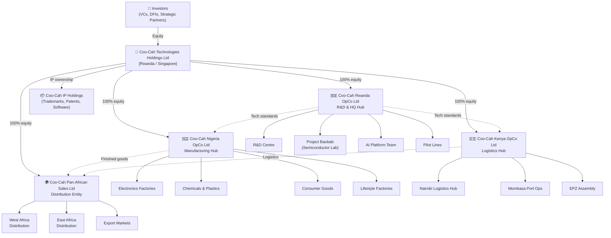

# Corporate Structure — Coo-Cah Technologies Holdings

## Overview

Coo-Cah Technologies Holdings is the apex holding company for all entities within the Coo-Cah industrial ecosystem. It is responsible for capital allocation, strategic direction, IP ownership, and governance across all operating companies (OpCos) and subsidiary entities.

---

## Legal Entities

### 1. Coo-Cah Technologies Holdings Ltd
- **Jurisdiction:** Rwanda (primary) / Singapore (secondary for international investment)
- **Type:** Private Limited Company / Holding Company
- **Role:** Apex holding entity; owns 100% of all OpCo equity
- **Responsibilities:** IP ownership, group treasury, international fundraising, group technology standards, brand licensing to OpCos
- **Registered Address:** Kigali Innovation City, Rwanda

### 2. Coo-Cah Nigeria OpCo Ltd
- **Jurisdiction:** Federal Republic of Nigeria
- **Registration:** Corporate Affairs Commission (CAC)
- **Type:** Limited Liability Company
- **Role:** Primary manufacturing OpCo — responsible for large-scale production across all factory verticals
- **P&L Responsibility:** Full P&L for Nigeria manufacturing operations
- **Key Locations:** Lagos (HQ), Ogun State (electronics/plastics SEZ), Delta State (chemicals), Abuja (consumer goods)
- **Regulatory Bodies:** NAFDAC (food/pharma), SON (standards), NESREA (environment), FIRS (taxation)

### 3. Coo-Cah Rwanda OpCo Ltd
- **Jurisdiction:** Republic of Rwanda
- **Registration:** Rwanda Development Board (RDB)
- **Type:** Limited Liability Company
- **Role:** R&D hub, AI platform development, semiconductor research (Project Baobab), pilot production
- **P&L Responsibility:** Full P&L for Rwanda operations; cost-centre for group R&D
- **Key Locations:** Kigali Innovation City (R&D HQ), Kigali SEZ (pilot production)
- **Regulatory Bodies:** RDB, Rwanda ICT Chamber, Rwanda Standards Board

### 4. Coo-Cah Kenya OpCo Ltd
- **Jurisdiction:** Republic of Kenya
- **Registration:** Registrar of Companies (Business Registration Service)
- **Type:** Limited Liability Company
- **Role:** East Africa logistics hub, final assembly, distribution gateway
- **P&L Responsibility:** Full P&L for Kenya operations
- **Key Locations:** Nairobi (HQ), Nairobi EPZ (assembly), Mombasa (port logistics)
- **Regulatory Bodies:** KRA (taxation), KEBS (standards), NEMA (environment), EPZ Authority

### 5. Coo-Cah Pan-African Sales Ltd
- **Jurisdiction:** Rwanda (registered) / pan-African operations
- **Type:** Sales & Distribution Entity
- **Role:** Routes finished goods to all African markets; manages B2B and retail distribution partnerships
- **P&L Responsibility:** Revenue recognition for all group sales
- **Key Offices:** Lagos, Nairobi, Kigali, Accra, Cairo, Johannesburg

---

## Corporate Governance Model

### Board Structure

**Holdings Board (Group Level):**
- Group CEO
- Group CFO
- Group CTO
- Group COO
- 2× Independent Non-Executive Directors
- 1× Investor Representative (post Series A)

**OpCo Boards (Country Level):**
- Country Managing Director (MD)
- Country CFO
- Country COO
- Group CEO (ex-officio)
- 1× Independent Director per country

### Decision Rights Matrix

| Decision Type | Holdings Board | Country MD | Group CEO | Group CFO |
|--------------|---------------|------------|-----------|-----------|
| CapEx > $5M | Approve | Recommend | Recommend | Recommend |
| CapEx $500K–$5M | Notify | Approve | Approve | Recommend |
| CapEx < $500K | — | Approve | Notify | — |
| New factory vertical | Approve | Input | Recommend | Recommend |
| Technology standard changes | Approve | Input | Recommend | — |
| International fundraising | Approve | — | Lead | Lead |
| Opex budget (annual) | Approve | Propose | Review | Lead |
| Hiring MD/CxO | Approve | Input | Recommend | — |
| Hiring below MD | — | Approve | — | — |

---

## Full Corporate Structure Diagram

---

## Inter-Company Agreements

### Technology Licence Agreement (TLA)
Holdings licenses all software, AI models, MES configurations, and manufacturing IP to each OpCo under a Technology Licence Agreement. Royalty rate: 3% of net revenue, reinvested into R&D at Rwanda OpCo.

### Manufacturing Services Agreement (MSA)
Nigeria OpCo provides contract manufacturing services to the Pan-African Sales entity under a transfer pricing-compliant MSA. Pricing based on cost-plus methodology reviewed annually.

### Shared Services Agreement (SSA)
Rwanda OpCo provides AI platform, data engineering, IT infrastructure, and technology support services to all OpCos under a shared services model. Cost allocation based on factory headcount and compute usage.

### Inter-Company Logistics Agreement (ICLA)
Kenya OpCo provides logistics, warehousing, and freight forwarding services to all OpCos for East Africa distribution.

---

## Capital Structure

| Round | Target Amount | Use of Proceeds |
|-------|-------------|----------------|
| Seed / Founders | $2M | Rwanda R&D setup, proof-of-concept pilot lines |
| Series A | $25M | Phase 1 Nigeria electronics factories, energy systems |
| Series B | $75M | Chemicals, plastics, consumer goods factories (Phase 1) |
| Series C | $200M | Phase 2 automation, Project Baobab, Kenya hub |
| Growth / DFI | $500M+ | Phase 3 nationwide rollout, export market entry |

---

## Tax & Treasury Policy

- **Transfer Pricing:** All inter-company transactions priced at arm's length per OECD guidelines
- **Treasury Centre:** Holdings entity manages FX risk and group cash pooling
- **Dividend Policy:** OpCos remit 30% of annual profits to Holdings after local reinvestment requirements
- **DFI Compliance:** All operations comply with IFC Performance Standards for environmental and social governance (ESG)

---

*Last Updated: 2025 | Coo-Cah Technologies Holdings*
