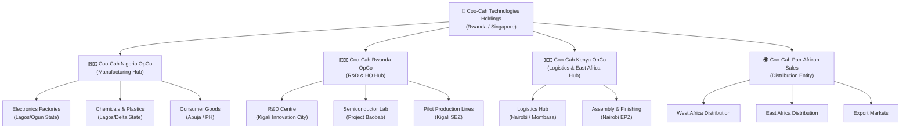

# Coo-Kah-Doks 🏭
> **Master Blueprint Repository** — The Single Source of Truth for Project Coo-Cah

[](https://oumar-code.github.io/Coo-Kah-Doks)
[]()
[]()

---

## What is Project Coo-Cah?

**Project Coo-Cah** is the vision to build Africa's most advanced vertically-integrated manufacturing ecosystem — a network of AI-powered, energy-autonomous smart factories spanning Nigeria, Rwanda, and Kenya. The goal is to manufacture everything from consumer electronics and power banks to chemicals, furniture, and food products — entirely on African soil, powered by renewable energy, and orchestrated by a central AI platform.

Coo-Cah Technologies Holdings is the parent entity that owns and governs all operating companies (OpCos). This repository, **Coo-Kah-Doks**, serves as the **master orchestrating repository**: the single source of truth for strategy, architecture, blueprints, and operational standards across the entire group.

---

## Corporate Structure



### Hub Summary

| Hub | Country | Primary Role | Key Advantage |
|-----|---------|-------------|---------------|
| **Manufacturing Hub** | 🇳🇬 Nigeria | Large-scale production | Massive market, labour force, raw materials |
| **R&D Hub** | 🇷🇼 Rwanda | Innovation, AI, Semiconductors | Ease of doing business, tech ecosystem |
| **Logistics Hub** | 🇰🇪 Kenya | Distribution, Assembly | Port of Mombasa, East Africa gateway |

---

## Repository Structure

```
Coo-Kah-Doks/
├── README.md                          ← You are here (Master Vision)
├── CORPORATE_STRUCTURE.md             ← Governance & legal entities
├── mkdocs.yml                         ← Documentation site config
├── docs/
│   ├── 00-vision/                     ← Mission, values, strategic intent
│   ├── 01-corporate-structure/        ← Holdings, OpCos, governance
│   ├── 02-energy-strategy/            ← Solar, wind, hybrid strategy
│   ├── 03-factories/                  ← Factory verticals overview
│   ├── 04-semiconductor/              ← Project Baobab (ASIC/foundry)
│   ├── 05-smart-factory-core/         ← MES, Digital Twin, AMR, Cobot
│   ├── 06-automation-phases/          ← Phase 1 → 2 → 3 roadmap
│   ├── 07-supply-chain/               ← Sourcing, kitting, logistics
│   ├── 08-ai-platform/                ← Central AI core architecture
│   ├── 09-compliance-regulatory/      ← Nigeria, Rwanda, Kenya regs
│   ├── 10-finance/                    ← CapEx/OpEx, investor materials
│   ├── adrs/                          ← Architectural Decision Records
│   └── glossary.md                    ← Key terms and definitions
├── factories/
│   ├── _template/                     ← Blueprint template for new factories
│   ├── electronics/                   ← Electronics vertical
│   │   ├── kitchen-electronics/
│   │   ├── garage-power-electronics/
│   │   ├── personal-electronics/
│   │   ├── smart-estate-city/
│   │   ├── smart-home-office/
│   │   └── security-electronics/
│   ├── chemicals/                     ← Chemicals vertical
│   │   ├── heavy-chemicals/
│   │   ├── fine-chemicals/
│   │   ├── fertilizer/
│   │   ├── plastics/
│   │   └── metallurgical/
│   ├── consumer-goods/                ← FMCG vertical
│   │   ├── food-and-beverages/
│   │   ├── glass-and-ceramic/
│   │   ├── paint-and-coatings/
│   │   ├── cosmetics/
│   │   └── soap-and-detergent/
│   └── lifestyle/                     ← Lifestyle vertical
│       ├── furniture/
│       └── sport-and-apparel/
├── energy/
│   ├── solar-power-bank/
│   ├── wind-power-bank/
│   ├── hybrid-systems/
│   └── site-assessment-framework.md
├── orchestration/
│   ├── factory-status-registry.md
│   ├── cross-factory-dependencies.md
│   ├── central-ai-services.md
│   └── inter-factory-logistics.md
└── .github/
    ├── ISSUE_TEMPLATE/
    │   ├── factory-blueprint-request.md
    │   ├── adr-proposal.md
    │   └── phase-gate-approval.md
    └── workflows/
        ├── deploy-docs.yml
        └── lint-diagrams.yml
```

---

## Quick Links

| Section | Description |
|---------|-------------|
| [📋 Corporate Structure](./CORPORATE_STRUCTURE.md) | Holdings, OpCos, governance model |
| [🔭 Vision & Mission](./docs/00-vision/index.md) | Strategic intent and values |
| [⚡ Energy Strategy](./docs/02-energy-strategy/index.md) | Solar, wind, hybrid approach |
| [🏭 Factory Verticals](./docs/03-factories/index.md) | All factory categories and tiers |
| [💻 Semiconductor (Baobab)](./docs/04-semiconductor/index.md) | ASIC & foundry roadmap |
| [🤖 Smart Factory Core](./docs/05-smart-factory-core/index.md) | MES, AMR, Cobot, Digital Twin |
| [🗺️ Automation Phases](./docs/06-automation-phases/index.md) | Phase 1 → 2 → 3 milestones |
| [🧠 AI Platform](./docs/08-ai-platform/index.md) | Central AI core architecture |
| [📦 Supply Chain](./docs/07-supply-chain/index.md) | Cross-factory flows |
| [💰 Finance](./docs/10-finance/index.md) | CapEx/OpEx and investor materials |
| [📖 Glossary](./docs/glossary.md) | Key terms and definitions |

---

## Phased Implementation Strategy

Project Coo-Cah factories are commissioned in three automation phases. Each factory repo references back to this master document and tracks its phase status.

### Phase 1 — Human-in-the-Loop (Years 1–3)
Factories are operational with human operators. Automation assists rather than replaces. Data collection begins feeding the AI platform. MES is deployed and integrated.

**Key milestones:**
- MES live on all production lines
- IoT sensor coverage ≥ 85% of assets
- Digital twin baseline established
- Energy monitoring dashboards active
- Quality defect rate < 2%

### Phase 2 — Lights-Out Lines (Years 3–6)
Select production lines transition to fully automated, human-supervised operation. AMRs handle intra-factory logistics. Cobots perform repetitive assembly tasks. AI-driven scheduling and yield prediction active.

**Key milestones:**
- ≥ 1 fully lights-out production line per factory
- AMR fleet deployed (≥ 10 units per major factory)
- Predictive maintenance accuracy ≥ 92%
- Energy from renewables ≥ 60%
- Cobot-to-human ratio ≥ 2:1 on automated lines

### Phase 3 — Cognitive Autonomous Factory (Years 6–10)
The factory operates as a self-optimising system. The AI core handles scheduling, quality, maintenance, energy, and supply chain decisions. Human roles shift to oversight, innovation, and exception handling.

**Key milestones:**
- OEE (Overall Equipment Effectiveness) ≥ 85%
- Energy self-sufficiency ≥ 90%
- Zero unplanned downtime (predictive maintenance)
- AI-driven dynamic production scheduling
- Carbon neutral operations certified

---

## How Factory Repos Link to This Master Repo

Each factory maintains its own dedicated Git repository following the naming convention `coo-cah-factory-[vertical]-[name]`. Every factory repository:

1. References this master repo (`Coo-Kah-Doks`) as its source of truth
2. Uses the `factories/_template/` files as its blueprint foundation
3. Tracks its automation phase status in `orchestration/factory-status-registry.md`
4. Reports cross-factory dependencies in `orchestration/cross-factory-dependencies.md`
5. Consumes central AI services documented in `orchestration/central-ai-services.md`

Factory repos include a `MASTER_REPO_REF.md` file linking back to this document and specifying which version of the template they were instantiated from.

---

## Contributing

All architectural decisions, factory blueprints, and strategic documents follow the processes defined in this repository. See:
- [ADR Process](./docs/adrs/README.md) — For architectural decisions
- [Issue Templates](./.github/ISSUE_TEMPLATE/) — For blueprint requests and phase approvals
- [Glossary](./docs/glossary.md) — For terminology standards

---

*Coo-Cah Technologies Holdings — Building Africa's Industrial Future* 🌍