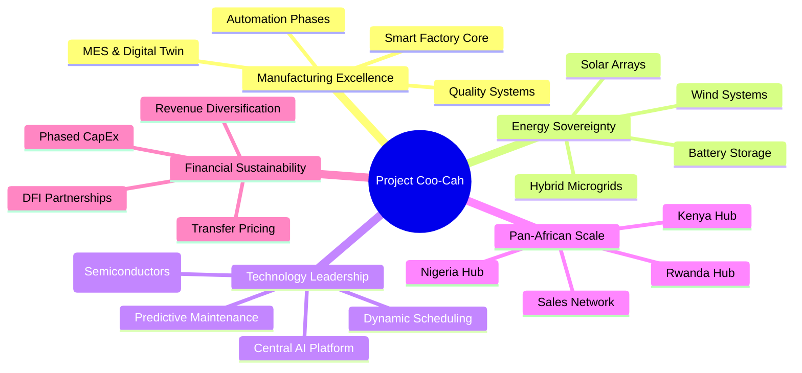

# Vision, Mission & Strategic Intent

## Vision

To become Africa's most advanced vertically-integrated manufacturing ecosystem — producing world-class goods entirely on African soil, powered by renewable energy, and orchestrated by artificial intelligence.

## Mission

To design, build, and operate a network of AI-powered smart factories across Nigeria, Rwanda, and Kenya that:
- Manufacture electronics, chemicals, consumer goods, and lifestyle products at global quality standards
- Achieve energy self-sufficiency through solar, wind, and hybrid systems
- Progressively automate from human-assisted to fully autonomous operation
- Generate sustainable employment and transfer skills to African talent
- Reduce Africa's dependency on imported manufactured goods

## Core Values

### 1. Technology-First
Every factory is a technology platform. We invest in MES, digital twins, AMRs, cobots, and AI before conventional expansion. Technology is our competitive moat.

### 2. African by Design
Products are designed for African markets, climates, power conditions, and consumers. We do not simply copy global products — we engineer solutions for African realities.

### 3. Energy Sovereignty
No factory operates at the mercy of unreliable grid power. Every facility has a renewable energy baseline that guarantees minimum production continuity.

### 4. Radical Transparency
All factory data — OEE, energy usage, yield rates, safety incidents — is visible in real-time through the central AI platform. There are no black boxes.

### 5. Kaizen Culture
Continuous improvement is embedded in every process. Every worker, cobot, and AI agent is empowered to flag inefficiencies and propose improvements.

### 6. Pan-African Ambition
We start with Nigeria, Rwanda, and Kenya — but the blueprint scales to Ghana, Ethiopia, South Africa, Egypt, and beyond. Every system, template, and process is designed for replication.

---

## Strategic Intent

### Why Manufacturing?
Africa imports over $500 billion worth of manufactured goods annually. The continent has the raw materials, the growing population, the expanding middle class, and the talent. What has been missing is the industrial infrastructure and the technology layer to make manufacturing globally competitive. Project Coo-Cah fills this gap.

### Why Now?
- African Continental Free Trade Area (AfCFTA) creates a 1.4 billion person market
- Renewable energy costs have fallen 90% in a decade — making off-grid factories viable
- AI and automation have matured to the point where small teams can operate large factories
- African tech talent is growing rapidly — Rwanda and Nigeria both have thriving engineering communities
- Development Finance Institutions (DFIs) are actively seeking bankable industrial projects in Africa

### Why These Countries?
- **Nigeria:** Largest economy and population in Africa. Massive domestic market. Existing manufacturing base to build upon. Raw material access.
- **Rwanda:** Best business environment in Africa (World Bank Ease of Doing Business). Government commitment to technology and innovation. Kigali Innovation City as a ready infrastructure base.
- **Kenya:** East Africa's commercial hub. Port of Mombasa gateway to regional markets. Strong tech ecosystem and skilled workforce.

---

## Strategic Pillars

---

## 10-Year Milestones

| Year | Milestone |
|------|-----------|
| Y1 | Rwanda R&D hub operational. Pilot electronics line commissioned in Kigali SEZ. |
| Y2 | Phase 1 Nigeria electronics factory live (kitchen + personal electronics). Plastics factory operational. |
| Y3 | Nigeria chemicals (heavy + fine) factories commissioned. Kenya logistics hub operational. |
| Y4 | Phase 2 automation begins on electronics lines. Project Baobab ASIC design team established. |
| Y5 | Consumer goods factories (food & beverages, soap, cosmetics) operational in Nigeria. |
| Y6 | First lights-out production line certified. AI platform managing multi-factory scheduling. |
| Y7 | Project Baobab first ASIC tapeout. Smart estate/city IoT product line launched. |
| Y8 | Lifestyle factories (furniture, apparel) operational. Pan-African distribution network at scale. |
| Y9 | Phase 3 Cognitive Autonomous Factory pilot at lead electronics factory. |
| Y10 | Full Phase 3 rollout across flagship factories. Energy self-sufficiency ≥ 90% group-wide. |

---

## Problem We Are Solving

### Africa's Manufacturing Gap
Despite having 30% of the world's mineral resources and 17% of the global population, Africa accounts for less than 2% of global manufacturing output. The consequences are severe:
- Chronic trade deficits draining foreign exchange reserves
- Youth unemployment exceeding 60% in urban areas
- Dependence on supply chains disrupted by global shocks (COVID-19, Red Sea crisis)
- Underutilisation of abundant raw materials shipped raw and returned as finished goods at 10× the price

### What Coo-Cah Changes
Coo-Cah transforms the equation by building technology-enabled factories that are:
- **Cost-competitive** through energy sovereignty and automation
- **Quality-compliant** through AI-driven quality management
- **Resilient** through local supply chains and energy independence
- **Scalable** through a replicable blueprint model

---

## Market Opportunity

### Addressable Markets (Selected)
| Product Category | Africa Import Value (2024 est.) | Coo-Cah Target Share (Y10) |
|-----------------|-------------------------------|---------------------------|
| Consumer Electronics | $18B | 8% |
| Chemicals & Plastics | $22B | 5% |
| Fast-Moving Consumer Goods | $45B | 3% |
| Furniture & Lifestyle | $8B | 6% |
| Agricultural Inputs (Fertilizer) | $12B | 4% |

Total addressable market (TAM) for Phase 1–3 factory portfolio: **~$105 billion annually**

---

*Coo-Cah Technologies Holdings — Building Africa's Industrial Future*
