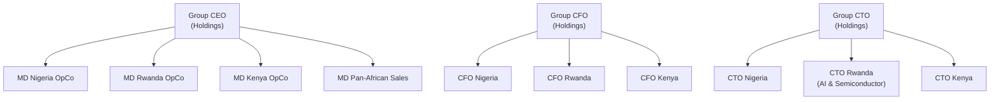

# Corporate Structure & Governance

> See also: [CORPORATE_STRUCTURE.md](../../CORPORATE_STRUCTURE.md) for the full legal entity document.

## Holdings + OpCo Model

Coo-Cah operates a classic Holdings + OpCo model optimised for:
1. **Risk isolation** — each country's legal, regulatory, and operational risks stay within that OpCo
2. **Capital efficiency** — Holdings can raise international capital and deploy to OpCos as needed
3. **Tax optimisation** — group IP held at Holdings level with arm's-length licensing to OpCos
4. **Governance clarity** — each OpCo board governs its own P&L; Holdings governs group strategy

## Entity Summary

| Entity | Jurisdiction | Role | P&L |
|--------|-------------|------|-----|
| Coo-Cah Technologies Holdings Ltd | Rwanda / Singapore | Apex holding, IP, treasury | Group |
| Coo-Cah Nigeria OpCo Ltd | Nigeria | Manufacturing (Tier 1, 2, 3) | Nigeria |
| Coo-Cah Rwanda OpCo Ltd | Rwanda | R&D, AI, Semiconductor | Rwanda |
| Coo-Cah Kenya OpCo Ltd | Kenya | Logistics, assembly, distribution | Kenya |
| Coo-Cah Pan-African Sales Ltd | Rwanda (ops pan-Africa) | Sales, distribution | Group Sales |
| Coo-Cah IP Holdings Ltd | Rwanda / Singapore | IP ownership | IP Royalties |

## Governance Framework

Each OpCo is governed by a local board with representation from Holdings. The governance framework follows international best practices including:

- **Quarterly business reviews** between Holdings and each OpCo MD
- **Annual strategic planning** cycle aligned across all entities
- **Group technology council** — monthly calls between CTOs of all entities
- **Group finance committee** — monthly calls between CFOs on treasury, FX, CapEx

## Reporting Structure

## Legal Frameworks

### Nigeria
- **CAC Registration** — Companies and Allied Matters Act (CAMA) 2020
- **Pioneer Status** — Application to NIPC for pioneer status in electronics manufacturing
- **Export Processing Zone** — Explore NEPZA for eligible factory categories
- **NAFDAC** — For food, beverages, cosmetics, personal care products
- **SON** — Nigeria Industrial Standards compliance for all manufactured goods

### Rwanda
- **RDB Registration** — Rwanda Development Board one-stop shop
- **Investment Code** — Rwanda Investment Code incentives (tax holidays, import duty exemptions)
- **Kigali Innovation City** — Special economic zone benefits
- **Rwanda ICT Chamber** — Technology sector membership and advocacy

### Kenya
- **BRS Registration** — Business Registration Service
- **EPZ Authority** — Export Processing Zones Authority for tax incentives on exports
- **KEBS** — Kenya Bureau of Standards compliance
- **KenTrade** — Kenya Trade Network for customs and logistics

## Transfer Pricing & Interco

All inter-company transactions are structured to comply with:
- OECD Transfer Pricing Guidelines
- Country-specific thin capitalisation rules
- African Tax Administration Forum (ATAF) guidelines

Key inter-company flows:
1. **IP Royalties:** OpCos → Holdings (3% of net revenue)
2. **Shared Services:** Rwanda OpCo → All OpCos (IT, AI, data services)
3. **Manufacturing:** Nigeria OpCo → Pan-African Sales (cost-plus)
4. **Logistics:** Kenya OpCo → Pan-African Sales (cost-plus)

## Shareholder Rights & Investor Protections

Holdings is structured to accommodate institutional investors (DFIs, venture capital, strategic partners) with:

- **ROFO/ROFR** (Right of First Offer / Right of First Refusal) on share transfers
- **Drag-along and tag-along rights** for all shareholders above 5% threshold
- **Anti-dilution provisions** for Series A and above investors (weighted average)
- **Information rights:** Quarterly management accounts, annual audited financials, monthly KPI dashboard access
- **Board representation:** Investors holding ≥ 15% equity entitled to one board seat at Holdings level

## ESG Governance

All entities operate under an ESG framework aligned with:
- **IFC Performance Standards** (PS1–PS8)
- **UN Sustainable Development Goals** (SDGs) — focus on SDG 8, 9, 13
- **GRI Sustainability Reporting Standards**
- **African Union Agenda 2063** industrial development goals

Annual ESG report published by Holdings covering:
- Carbon emissions (Scope 1, 2, 3)
- Water usage and recycling rates
- Waste generation and treatment
- Employee safety (TRIR, LTIR)
- Community investment
- Women in manufacturing percentage (target: ≥ 40%)
- Local procurement percentage (target: ≥ 60%)

---

*For full legal entity details, see [CORPORATE_STRUCTURE.md](../../CORPORATE_STRUCTURE.md)*
