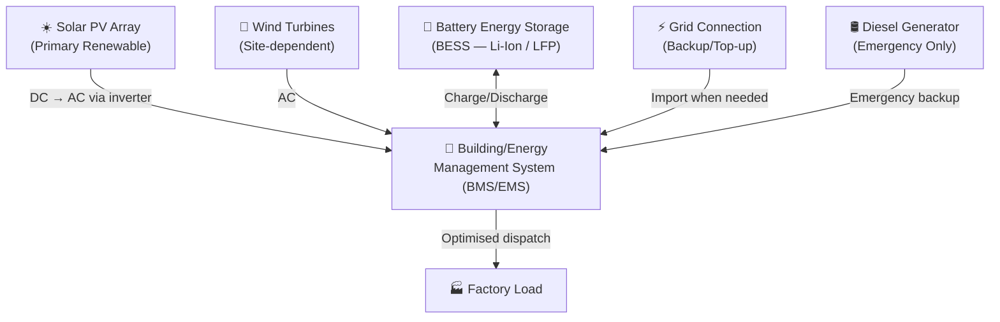

# Energy Strategy

## Overview

Energy is the single most critical infrastructure constraint for African manufacturing. Unreliable grid power, high electricity tariffs, and frequent outages make conventional grid-dependent manufacturing uncompetitive. Coo-Cah's energy strategy is built on a non-negotiable principle:

> **Every factory must achieve a minimum baseline of renewable energy self-sufficiency before commercial production begins.**

## Energy Architecture

Each Coo-Cah factory has a three-layer energy architecture:



### Layer 1: Solar PV (Primary)
All factories install rooftop and/or ground-mounted solar PV as the primary energy source. Minimum system size is calculated at 120% of peak daily energy demand (kWh) divided by peak sun hours at site.

### Layer 2: Battery Energy Storage System (BESS)
All factories deploy lithium iron phosphate (LFP) battery storage sized to cover minimum 8 hours of base load operation at night or during adverse weather. BESS is managed by the factory Energy Management System (EMS).

### Layer 3: Grid + Generator (Backup)
Grid connection is maintained for surplus export and emergency import. Diesel generators are sized only for emergency power (< 15% of total demand) and are operated to comply with local environmental regulations.

## Site-by-Site Energy Profile

| Factory | Location | Recommended Primary | Supplementary | Storage Target |
|---------|----------|---------------------|---------------|---------------|
| Kitchen Electronics | Lagos, Nigeria | Solar PV (rooftop) | Grid backup | 12h base load |
| Garage/Power Electronics | Ogun State | Solar PV (rooftop + ground) | Wind (if coastal) | 16h base load |
| Personal Electronics | Lagos | Solar PV (rooftop) | Grid backup | 8h base load |
| Heavy Chemicals | Delta State | Solar PV + Wind | Grid | 8h base load |
| Plastics | Ogun State | Solar PV | Grid backup | 8h base load |
| Fertilizer | Delta State | Solar PV + Wind | Grid | 24h base load |
| Food & Beverages | Abuja, Nigeria | Solar PV | Grid backup | 12h base load |
| R&D Centre | Kigali, Rwanda | Solar PV (rooftop) | Grid backup | 8h base load |
| Logistics Hub | Nairobi, Kenya | Solar PV | Grid backup | 4h base load |

## Solar Strategy

### Panel Technology
- **Tier 1 preference:** Monocrystalline PERC panels (≥ 22% efficiency)
- **Backup:** Polycrystalline (where cost-constrained)
- **Mounting:** Fixed tilt optimised for site latitude; single-axis trackers for ground-mount arrays > 500kWp

### Inverter Strategy
- **String inverters** for systems < 100kWp
- **Central inverters** for systems 100kWp–1MWp
- **Hybrid inverters** with BESS integration for all primary systems

### Sizing Methodology
1. Audit factory energy demand (kWh/day, kW peak)
2. Obtain NASA POWER or SolarGIS irradiance data for site location
3. Calculate array size: `Array (kWp) = Daily demand (kWh) / (PSH × system efficiency 0.75)`
4. Size BESS: `BESS (kWh) = Base load (kW) × Autonomy hours / DoD (0.8 for LFP)`
5. Verify roof/land area availability

## Wind Strategy

Wind energy is deployed at sites meeting minimum criteria:
- Average wind speed ≥ 5.5 m/s at hub height
- Clear fetch (no major obstructions within 10× rotor diameter)
- Environmental/community impact assessment cleared

Preferred wind turbine types:
- **Small wind (< 100kW):** Horizontal axis turbines from certified suppliers
- **Medium wind (100kW–2MW):** Grid-scale HAWT with full grid-forming capability

Applicable sites: Delta State (Nigeria coastal), Mombasa (Kenya coastal/highland), Rwanda highlands.

## Hybrid Systems

For sites where neither solar nor wind alone is sufficient, hybrid microgrids are deployed combining:
- Solar PV + BESS + Grid
- Solar PV + Wind + BESS
- Solar PV + Wind + BESS + Biogas (for factories with organic waste — e.g., food & beverages)

### Hybrid Dispatch Logic

The Energy Management System (EMS) follows a merit-order dispatch:

```
Priority 1: Solar PV output (zero marginal cost)
Priority 2: Wind turbine output (zero marginal cost)
Priority 3: BESS discharge (if SOC > 20%)
Priority 4: Grid import (if available and price < threshold)
Priority 5: Generator (emergency only, fuel cost + emissions)
```

Excess renewable generation is:
1. Used to charge BESS (if SOC < 95%)
2. Exported to grid (if grid-export agreement in place)
3. Curtailed (last resort, triggers alert to EMS)

## Energy Management System (EMS)

The factory EMS is a software platform integrated with the central AI platform that provides:

- **Real-time monitoring:** All energy assets visible on a live dashboard
- **Automated dispatch:** AI-driven switching between energy sources based on demand, price, and SOC
- **Demand forecasting:** ML model predicts factory energy demand 24–72 hours ahead
- **Fault detection:** Anomaly detection on solar inverters, battery cells, and grid meters
- **Reporting:** Automated monthly energy reports for OpCo management and Holdings treasury

### EMS Integration Points
- Connects to factory MES (reads production schedule → predicts energy demand)
- Connects to Central AI Platform (pushes energy data → feeds group-wide optimisation)
- Connects to SCADA systems of solar/wind assets
- Connects to smart meters for grid import/export metering
- Connects to BMS (Battery Management System) of BESS

## Energy KPIs

| KPI | Phase 1 Target | Phase 2 Target | Phase 3 Target |
|-----|---------------|----------------|----------------|
| % Energy from Renewables | ≥ 40% | ≥ 65% | ≥ 90% |
| Grid dependency (% total) | < 60% | < 35% | < 10% |
| Generator usage (hours/month) | < 48h | < 12h | < 2h |
| Energy cost ($/kWh blended) | < $0.14 | < $0.10 | < $0.07 |
| Carbon intensity (kgCO₂/MWh) | < 200 | < 100 | < 20 |
| BESS round-trip efficiency | ≥ 92% | ≥ 94% | ≥ 95% |
| Solar system availability | ≥ 97% | ≥ 98% | ≥ 99% |
| Energy cost as % of CoGS | < 12% | < 8% | < 5% |

## Regulatory & Grid Interface

### Nigeria
- **NERC** (Nigerian Electricity Regulatory Commission): Licence required for embedded generation > 1MW
- **DisCo agreements:** Net metering or buy-back agreements with Distribution Companies (DisCos)
- **NEMSA** (Nigerian Electricity Management Services Agency): Safety certification for all electrical installations

### Rwanda
- **RURA** (Rwanda Utilities Regulatory Authority): Licence for generation and off-grid systems
- **REG** (Rwanda Energy Group): Grid connection agreements and power purchase framework

### Kenya
- **ERC** (Energy & Petroleum Regulatory Authority): Licence for embedded generation
- **KPLC** (Kenya Power): Net metering framework for grid-connected solar systems

## Group Energy Procurement

Holdings negotiates group-level PPAs (Power Purchase Agreements) with renewable energy developers. OpCos benefit from:
- Bulk procurement pricing (estimated 15–20% reduction vs. spot market)
- Standardised O&M contracts
- Group insurance for energy assets
- Shared spare parts inventory for solar/wind equipment
- Group carbon credits portfolio management

---

*See also: [Solar Power Bank](../energy/solar-power-bank/README.md) | [Wind Power Bank](../energy/wind-power-bank/README.md) | [Hybrid Systems](../energy/hybrid-systems/README.md)*
