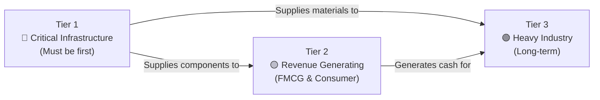
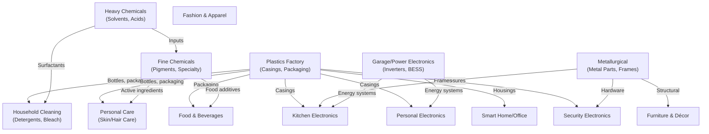

# Factory Verticals Overview

## Production Tiers

Coo-Cah factories are classified into three production tiers based on strategic priority, complexity, and interdependency.

### Tier 1 — Critical Infrastructure Factories
These factories must be commissioned first because they supply inputs to all other factories. Without Tier 1, other production lines cannot operate self-sufficiently.

| Factory | Output | Feeds Into |
|---------|--------|-----------|
| **Plastics** | Casings, packaging, structural parts | Electronics, consumer goods, chemicals |
| **Electronics (Power Banks/Inverters)** | Energy storage, power conversion | All factories (energy systems) |
| **Metallurgical** | Metal parts, frames, structural components | Electronics, machinery, furniture |

### Tier 2 — Revenue-Generating Factories
These factories generate the primary cash flows that fund the broader ecosystem. They are high-volume, fast-moving consumer goods (FMCG) operations.

| Factory | Products | Market |
|---------|---------|--------|
| **Kitchen Electronics** | Refrigerators, microwaves, cookers, blenders | B2C Nigeria, regional |
| **Personal Electronics** | Smartphones, power banks, headphones | B2C pan-Africa |
| **Food & Beverages** | Packaged foods, drinks | B2C Nigeria, regional |
| **Soap & Detergent** | Soaps, washing powders, liquid detergents | B2C pan-Africa |
| **Cosmetics** | Personal care, skincare, haircare | B2C Nigeria, regional |

### Tier 3 — Heavy Industry Factories
Long-cycle, capital-intensive operations that provide strategic vertical integration and raw material independence.

| Factory | Products | Strategic Purpose |
|---------|---------|-----------------|
| **Heavy Chemicals** | Industrial solvents, acids, bases | Inputs for all chemical processes |
| **Fine Chemicals** | Specialty chemicals, pigments | Paints, cosmetics, food additives |
| **Fertilizer** | NPK, urea, compound fertilizers | Agriculture supply chain |
| **Metallurgical** | Steel, aluminum processing | Heavy industry feedstock |

---

## All Factory Verticals

### Electronics Vertical

| Factory | Location | Phase | Key Products |
|---------|----------|-------|-------------|
| [Kitchen Electronics](../factories/electronics/kitchen-electronics/README.md) | Lagos, Nigeria | Phase 1 | Fridges, microwaves, cookers, kettles |
| [Garage/Power Electronics](../factories/electronics/garage-power-electronics/README.md) | Ogun State, Nigeria | Phase 1 | Inverters, solar systems, power strips |
| [Personal Electronics](../factories/electronics/personal-electronics/README.md) | Lagos, Nigeria | Phase 1 | Smartphones, power banks, headphones |
| [Smart Estate/City](../factories/electronics/smart-estate-city/README.md) | Kigali, Rwanda | Phase 2 | IoT sensors, smart street lighting |
| [Smart Home/Office](../factories/electronics/smart-home-office/README.md) | Lagos, Nigeria | Phase 2 | Smart plugs, thermostats, voice assistants |
| [Security Electronics](../factories/electronics/security-electronics/README.md) | Lagos, Nigeria | Phase 2 | CCTV, alarms, biometric locks |

### Chemicals Vertical

| Factory | Location | Phase | Key Products |
|---------|----------|-------|-------------|
| [Plastics](../factories/chemicals/plastics/README.md) | Ogun State, Nigeria | Phase 1 | Casings, packaging, structural parts |
| [Heavy Chemicals](../factories/chemicals/heavy-chemicals/README.md) | Delta State, Nigeria | Phase 2 | Solvents, acids, industrial chemicals |
| [Fine Chemicals](../factories/chemicals/fine-chemicals/README.md) | Lagos, Nigeria | Phase 2 | Specialty chemicals, pigments |
| [Fertilizer](../factories/chemicals/fertilizer/README.md) | Delta State, Nigeria | Phase 3 | NPK, urea, compound fertilizers |
| [Metallurgical](../factories/chemicals/metallurgical/README.md) | Delta State, Nigeria | Phase 3 | Steel, aluminum processing |

### Consumer Goods Vertical

| Factory | Location | Phase | Key Products |
|---------|----------|-------|-------------|
| [Food & Beverages](../factories/consumer-goods/food-beverages/README.md) | Abuja, Nigeria | Phase 1 | Packaged food, beverages |
| [Personal Care](../factories/consumer-goods/personal-care/README.md) | Lagos, Nigeria | Phase 1 | Skin care, hair care, oral hygiene |
| [Household Cleaning](../factories/consumer-goods/household-cleaning/README.md) | Lagos, Nigeria | Phase 1 | Detergents, disinfectants, bleach |
| [Packaged Water](../factories/consumer-goods/packaged-water/README.md) | Lagos, Nigeria | Phase 1 | Sachet water, 50cl–5L bottles |
| [Baby & Infant Products](../factories/consumer-goods/baby-products/README.md) | Lagos, Nigeria | Phase 2 | Diapers, wipes, baby care |

### Lifestyle Vertical

| Factory | Location | Phase | Key Products |
|---------|----------|-------|-------------|
| [Fashion & Apparel](../factories/lifestyle/fashion-apparel/README.md) | Lagos, Nigeria | Phase 2 | Clothing, uniforms, sportswear |
| [Furniture & Home Décor](../factories/lifestyle/furniture-decor/README.md) | Abuja, Nigeria | Phase 2 | Office, home, and industrial furniture |

---

## Inter-Factory Dependency Map

---

## Factory Standards

All Coo-Cah factories must comply with these group-wide standards regardless of vertical or tier:

1. **ISO 9001:2015** — Quality Management System
2. **ISO 14001:2015** — Environmental Management System
3. **ISO 45001:2018** — Occupational Health & Safety
4. **ISO 50001:2018** — Energy Management System
5. **IEC 62443** — Industrial cybersecurity standards
6. **MES Integration Standard** — Coo-Cah internal standard for MES API connectivity
7. **Digital Twin Baseline** — Minimum asset coverage for digital twin

## Factory Status Registry

Factory commissioning status is tracked in [orchestration/factory-status-registry.md](../orchestration/factory-status-registry.md).

Status codes used:
- `PLANNED` — Feasibility/design phase
- `UNDER_CONSTRUCTION` — Civil and equipment installation
- `COMMISSIONING` — Testing and qualification runs
- `PHASE_1_ACTIVE` — Human-in-the-loop production
- `PHASE_2_ACTIVE` — Lights-out lines operational
- `PHASE_3_ACTIVE` — Cognitive autonomous operation

---

*See [Factory Template](../factories/_template/README.md) for the standard blueprint format used by all factory repos.*
