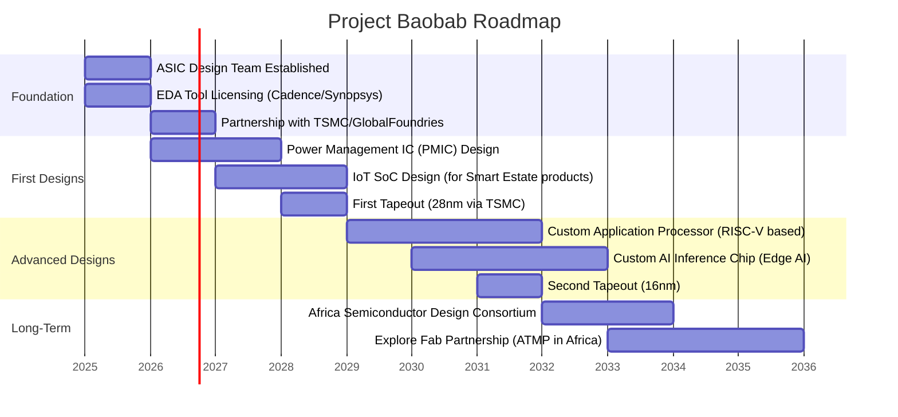

# Project Baobab — Semiconductor Foundry Strategy

## Executive Summary

**Project Baobab** is Coo-Cah's long-term strategic initiative to develop indigenous semiconductor design and, ultimately, manufacturing capabilities in Africa. Named after the iconic African tree — deeply rooted, resilient, and long-lived — Project Baobab represents the most ambitious element of the Coo-Cah technology vision.

> *"He who controls the chip controls the product."*

## Rationale for Vertical Integration

### Current Dependency Risk
All electronics manufactured by Coo-Cah in Phase 1 and Phase 2 use imported integrated circuits — microcontrollers, power management ICs, communication chips, and application processors. This creates:
- Supply chain vulnerability (as demonstrated by the 2020–2022 global chip shortage)
- Cost inefficiency (chip markup 300–500% from distributor to OEM)
- Technology dependency on US, Taiwan, South Korea, and China
- Limited ability to customise silicon for Africa-specific requirements (temperature range, voltage variation, EMI environments)

### Strategic Opportunity
ASICs (Application-Specific Integrated Circuits) designed in-house for Coo-Cah's own product lines can:
- Reduce BOM (Bill of Materials) cost by 15–40% per unit
- Enable features optimised for African markets (offline-first, low-power, solar-aware)
- Create a defensible technology moat
- Seed an African semiconductor ecosystem

## 5–10 Year Roadmap



## Phase 1: ASIC Design Capability (Years 1–3)

### Objectives
- Establish a world-class ASIC design team at the Rwanda R&D hub (Kigali Innovation City)
- License industry-standard EDA (Electronic Design Automation) tools
- Partner with established foundries (TSMC, GlobalFoundries, Samsung) for fabrication
- Design first-generation power management IC (PMIC) for use in power bank and inverter products

### Team Structure
- **VP of Silicon Engineering** — experienced chip architect (global hire)
- **RTL Design Engineers** × 4 — experienced with Verilog/SystemVerilog
- **Physical Design Engineers** × 2 — place & route specialists
- **Verification Engineers** × 3 — UVM/formal verification
- **DFT Engineers** × 1 — design for testability
- **Package & Test Engineers** × 2 — ATMP expertise
- **Graduate Trainees** × 10 — Rwandan/Nigerian engineering graduates

### First Target Designs
1. **CCC-PMIC-01:** 4-channel power management IC for power bank products (targeting 40nm node)
2. **CCC-MCU-01:** Ultra-low-power microcontroller for IoT sensor applications (targeting 55nm node)
3. **CCC-WIFI-BLE-01:** Combined Wi-Fi 4 + BLE 5.0 module for smart home/office products

### EDA Tool Stack
| Tool | Vendor | Use |
|------|--------|-----|
| Virtuoso | Cadence | Analog/mixed-signal design |
| Genus / Innovus | Cadence | Synthesis and physical design |
| Xcelium | Cadence | Simulation |
| JasperGold | Cadence | Formal verification |
| Calibre | Siemens EDA | DRC/LVS physical verification |
| StarRC | Synopsys | Parasitic extraction |
| PrimeTime | Synopsys | Static timing analysis |
| OpenROAD | Open-source | Secondary flow / cost reduction |

## Phase 2: SoC Development (Years 3–7)

### Objectives
- Develop a full System-on-Chip (SoC) platform for smart estate and personal electronics products
- Integrate RISC-V CPU cores (open architecture, no licensing fees)
- Add custom accelerators for audio processing, image processing, and ML inference
- Second tapeout at advanced node (16nm or 12nm)

### SoC Architecture (Target)
```
CCC-SOC-01 Architecture:
- 4× RISC-V RV64GC cores (application cores)
- 2× RISC-V RV32IM cores (management cores)
- 4× TOPS neural processing unit (NPU) for edge AI
- Integrated Wi-Fi 6 + BLE 5.3 + Zigbee
- LPDDR4/5 memory controller
- eMMC 5.1 / UFS 3.1 storage controller
- H.265/H.264 video codec
- Camera ISP for up to 108MP
- Audio DSP
- Security enclave (TRNG, AES-256, secure boot)
- Fabrication target: TSMC 12nm FFC
```

### RISC-V Strategy
Coo-Cah adopts RISC-V as its primary CPU ISA for the following reasons:
- **No licensing fees** — unlike ARM (which requires substantial royalty payments)
- **Open ecosystem** — growing community, toolchain maturity (GCC, LLVM, FreeRTOS, Linux)
- **Customisable** — can add custom extensions for Africa-specific use cases
- **Geopolitically neutral** — not subject to US export controls that affect ARM or x86

The group will contribute improvements back to the RISC-V International Foundation and the OpenHW Group.

## Phase 3: Advanced Capabilities (Years 7–10)

### Long-Term Vision
- Develop a custom AI inference chip for use in factory automation (edge AI for quality inspection, predictive maintenance)
- Explore Assembly, Test, Measurement & Packaging (ATMP) facility in Africa (likely Rwanda or Ethiopia)
- Seed the **Africa Semiconductor Design Consortium** — open-source chip designs for African manufacturers
- License Coo-Cah ASIC designs to third-party African electronics manufacturers

### Edge AI Chip Specification (Concept)
```
CCC-EDGE-AI-01 (Concept):
- 32× TOPS NPU for real-time vision inference
- 4× RISC-V RV64GC host cores
- On-chip SRAM: 64MB
- Supported frameworks: TensorFlow Lite, ONNX Runtime
- I/O: PCIe 4.0 ×4, USB 3.2, MIPI CSI-2 ×4
- Power: < 15W TDP
- Fabrication: 7nm (target)
- Application: Factory vision quality inspection, AMR navigation
```

## IP Strategy

All semiconductor IP created by Project Baobab is owned by **Coo-Cah IP Holdings Ltd** and licensed to all group OpCos under the Technology Licence Agreement. Third-party licensing will be considered from Year 8 onwards as a revenue stream.

### Open Source Strategy
- RTL for utility IPs (FIFOs, PLLs, standard interfaces) will be contributed to the OpenROAD and OpenLane communities
- Proprietary IPs (CPU clusters, NPU architecture, RF front-ends) will remain closed-source
- Educational collaboration with University of Rwanda, University of Lagos, and University of Nairobi

## Partnerships & Ecosystem

| Partner Type | Target Partners | Purpose |
|-------------|----------------|---------|
| Foundry | TSMC, GlobalFoundries, Samsung Foundry | IC fabrication |
| EDA Tools | Cadence, Synopsys, Siemens EDA | Design tools |
| ATMP | ASE Group, Amkor Technology | Packaging and test |
| IP Licensing | ARM (limited), MIPS, Imagination Technologies | Licensed IP blocks |
| Academia | U of Rwanda, U of Lagos, MIT, TU Berlin | Talent pipeline, research |
| Government | RDB Rwanda, NITDA Nigeria | Incentives, funding |

## Financial Model

| Phase | Years | CapEx | Description |
|-------|-------|-------|-------------|
| Design Setup | 1–2 | $15M | EDA tools, team, equipment, lab setup |
| First Tapeout | 2–3 | $8M | TSMC NRE, wafers, test |
| SoC Development | 3–6 | $25M | Team scale-up, advanced node NRE |
| Second Tapeout | 6–7 | $20M | 12nm tapeout, packaging |
| ATMP Exploration | 8–10 | $150M+ | Packaging and test facility (if viable) |

### Return on Investment
- Phase 1 PMIC design: Expected $4–6 savings per power bank unit × 2M units/year = **$8–12M annual savings**
- Phase 2 SoC: Expected $18–25 savings per personal electronics unit × 5M units/year = **$90–125M annual savings**
- Licensing revenue (from Year 8): Estimated $5–15M/year from third-party African manufacturers

---

*Project Baobab is managed by Coo-Cah Rwanda OpCo with oversight from Holdings CTO.*
