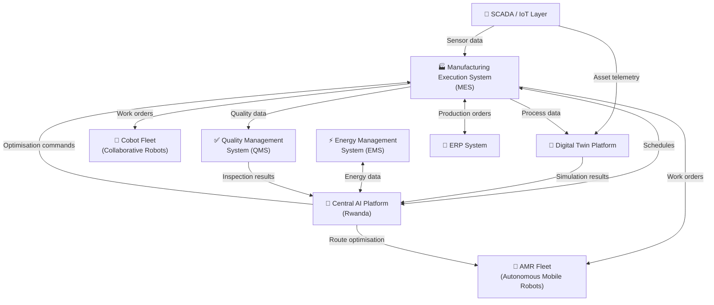
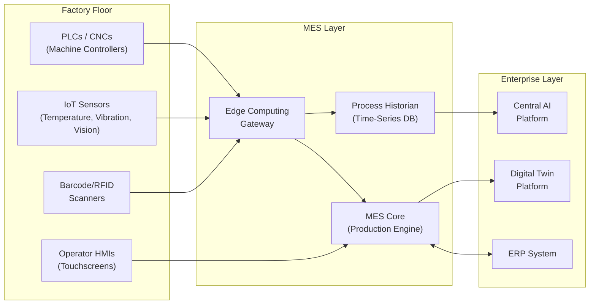
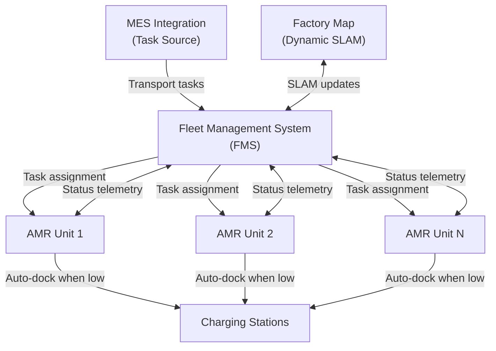

# Smart Factory Core — MES, Digital Twin, AMR, Cobot & AI Integration

## Overview

The Smart Factory Core is the technology stack that transforms a conventional factory into a data-driven, progressively autonomous manufacturing system. Every Coo-Cah factory deploys the same core technology stack — ensuring interoperability, shared data models, and consistent performance benchmarking across the group.



---

## 1. Manufacturing Execution System (MES)

### Purpose
The MES is the operational backbone of each factory. It bridges the gap between ERP-level business planning and shop-floor execution — translating production orders into real-time work instructions, tracking WIP (Work-in-Progress), and recording actual vs. planned performance.

### Core MES Functions

| Module | Function |
|--------|----------|
| **Production Scheduling** | Sequencing of work orders across all production lines |
| **Work Order Management** | Dispatching, tracking, and closing work orders per shift |
| **Materials Management** | BOM consumption tracking, scrap recording, inventory updates |
| **Labour Management** | Shift assignments, operator certifications, time & attendance |
| **Quality Management** | In-process inspection triggers, SPC (Statistical Process Control) |
| **Equipment Management** | Machine status tracking, OEE calculation, downtime classification |
| **Traceability** | Component-level genealogy tracking from raw material to finished good |
| **Document Control** | Work instructions, standard operating procedures (SOPs), ECNs |
| **Energy Monitoring** | Per-machine energy consumption linked to production output |
| **Performance Analytics** | OEE, yield, cycle time, and first-pass yield (FPY) dashboards |

### MES Architecture



### MES Platform Selection
See [ADR-002: MES Platform Selection](../adrs/ADR-002-mes-platform-selection.md) for the full decision record. The selected platform is **Siemens Opcenter** (cloud-managed with on-premise edge nodes) for Phase 1 factories, with migration to a custom AI-native MES considered for Phase 3.

### OEE Formula & Targets

```
OEE = Availability × Performance × Quality

Availability = (Planned Run Time - Downtime) / Planned Run Time
Performance  = (Ideal Cycle Time × Total Parts) / Run Time
Quality      = Good Parts / Total Parts
```

| Phase | OEE Target | Availability | Performance | Quality |
|-------|-----------|-------------|------------|---------|
| Phase 1 | ≥ 65% | ≥ 85% | ≥ 80% | ≥ 95% |
| Phase 2 | ≥ 78% | ≥ 92% | ≥ 88% | ≥ 97% |
| Phase 3 | ≥ 88% | ≥ 97% | ≥ 93% | ≥ 98% |

---

## 2. Digital Twin Platform

### What is a Digital Twin?
A digital twin is a living virtual replica of a physical asset, process, or system. For Coo-Cah factories, digital twins are used at three levels:
1. **Asset-level:** Individual machine modelling (CNC, injection moulder, conveyor)
2. **Line-level:** Production line simulation including material flow and bottleneck analysis
3. **Factory-level:** Full factory model for layout optimisation and energy simulation

### Digital Twin Use Cases

| Use Case | Benefit |
|----------|---------|
| Predictive maintenance | Detects bearing wear, motor degradation before failure |
| Process optimisation | Simulates parameter changes without disrupting live production |
| Bottleneck analysis | Identifies throughput constraints before they manifest physically |
| Layout planning | Tests new machine placements in simulation before physical move |
| Energy optimisation | Models energy demand against production schedules |
| New product introduction | Validates production process before committing to tooling |
| Training simulation | Operators train on virtual machines before touching physical equipment |

### Digital Twin Technology Stack
- **3D Modelling:** Siemens NX, Autodesk Inventor (asset-level)
- **Process Simulation:** Siemens Plant Simulation, AnyLogic (line/factory-level)
- **Real-time Synchronisation:** OPC-UA data bridge from SCADA to twin
- **Physics Engine:** Siemens Simcenter for thermodynamic and mechanical simulation
- **Visualisation:** Unity 3D (for VR walkthrough), web-based dashboard (for daily use)

---

## 3. AMR Fleet Management

### What are AMRs?
Autonomous Mobile Robots (AMRs) navigate factory floors independently using LIDAR, cameras, and AI-based path planning. Unlike traditional AGVs (Automated Guided Vehicles), AMRs do not require fixed paths or floor markings — they adapt dynamically to the environment.

### AMR Use Cases in Coo-Cah Factories

| Use Case | Description |
|----------|-------------|
| **Material transport** | Moving raw materials from warehouse to production line |
| **WIP transfer** | Moving sub-assemblies between workstations |
| **Finished goods staging** | Transporting finished goods to packing/shipping area |
| **Bin replenishment** | Refilling component bins at assembly stations (kanban) |
| **Waste collection** | Collecting scrap and waste from production lines |
| **Goods-to-person picking** | Bringing shelves of components to pick stations |

### AMR Fleet Architecture



### AMR Deployment Plan

| Phase | Units per Major Factory | Use Cases Covered |
|-------|------------------------|------------------|
| Phase 1 | 3–5 | Material delivery to lines, waste collection |
| Phase 2 | 10–20 | Full intra-factory logistics, kanban replenishment |
| Phase 3 | 25–50 | Fully autonomous factory logistics, lights-out material flow |

### AMR Technical Requirements
- Payload capacity: 50–500 kg depending on use case
- Navigation: LIDAR-based SLAM + camera fusion
- Safety: ISO 3691-4 compliant, emergency stop, collision avoidance
- Fleet Management: Centralised FMS with MES/WMS integration
- Connectivity: Wi-Fi 6 or 5G private network
- Battery: LFP, 8–12 hour continuous operation, opportunity charging

---

## 4. Cobot Deployment Strategy

### What are Cobots?
Collaborative robots (cobots) are designed to work safely alongside humans without traditional safety fencing. They are force-limited, vision-guided, and easily reprogrammable — ideal for the Coo-Cah progressive automation strategy.

### Cobot Use Cases

| Use Case | Product Vertical | Phase |
|----------|-----------------|-------|
| PCB assembly | Electronics | Phase 2 |
| Screw driving & fastening | Electronics, Furniture | Phase 2 |
| Adhesive dispensing | Electronics, Furniture | Phase 2 |
| Pick-and-place | All verticals | Phase 2 |
| Quality inspection (with vision) | All verticals | Phase 2 |
| Packaging & palletising | All verticals | Phase 3 |
| Welding assistance | Metallurgical, Furniture | Phase 3 |
| Liquid dispensing (chemicals) | Chemicals, Consumer Goods | Phase 3 |

### Cobot Fleet Standards
- **Preferred platforms:** Universal Robots UR series, Fanuc CR series, KUKA LBR iiwa
- **Programming:** Low-code teach pendant for Phase 1 operators; Python/ROS2 scripting for Phase 2+
- **Safety standard:** ISO/TS 15066 — Robots and robotic devices: Collaborative industrial robots
- **Vision systems:** Intel RealSense / Cognex In-Sight for guidance and inspection
- **Force sensing:** Integrated force/torque sensor for all assembly tasks

### Cobot-to-Human Ratio Targets

| Phase | Ratio Target | Notes |
|-------|-------------|-------|
| Phase 1 | 0:1 (no cobots) | Human-only; data collection mode |
| Phase 2 | 2:1 cobots per human on automated lines | Cobots assist; humans supervise |
| Phase 3 | 10:1 or lights-out | Humans as exception handlers only |

---

## 5. SCADA / IoT Sensor Layer

### Sensor Coverage Requirements
All Coo-Cah factories must meet minimum sensor coverage before Phase 1 production begins:
- **Vibration sensors** on all rotating machinery (motors, gearboxes, pumps)
- **Temperature sensors** on all thermal processes (ovens, reactors, chillers)
- **Current/power meters** on all major electrical loads (machines > 1kW)
- **Vision cameras** at all quality inspection stations
- **Environmental sensors** (temperature, humidity, particulates) in clean rooms and sensitive areas
- **Level sensors** for all liquid tanks and raw material silos
- **Pressure sensors** for all pneumatic and hydraulic systems

### IoT Protocol Standards
- **OPC-UA:** Primary protocol for machine-to-MES communication
- **MQTT:** Lightweight IoT sensor data transmission to edge gateways
- **Modbus TCP/RTU:** Legacy machine integration
- **PROFINET:** Siemens PLC integration
- **REST/WebSocket:** Web-based dashboard and AI platform integration

---

*See also: [Automation Phases](../06-automation-phases/index.md) | [AI Platform](../08-ai-platform/index.md)*
