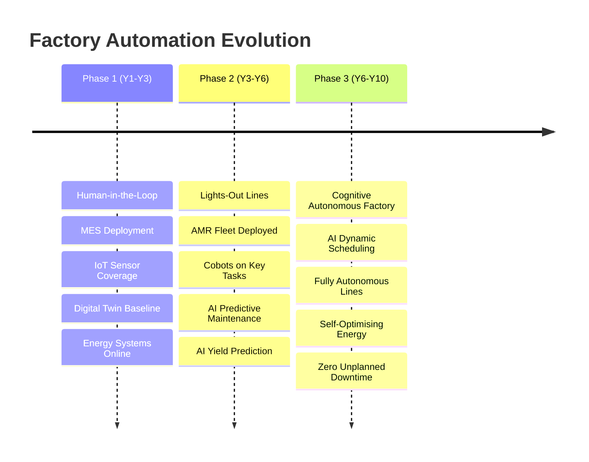
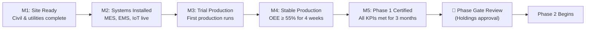

# Automation Phases — Implementation Roadmap

## Overview

Coo-Cah factories are commissioned and evolved through three distinct automation phases. This phased approach is deliberate: it minimises upfront capital risk, allows teams to build operational expertise, generates the data needed to train AI models, and progressively introduces automation as the business case matures.

---

## Phase 1 — Human-in-the-Loop (Years 1–3)

### Philosophy
Phase 1 is about **getting the fundamentals right**. Factories operate with human operators on every line. Technology assists, monitors, and records — but does not yet drive decisions autonomously. The primary goal is to:
1. Prove product quality and production throughput
2. Build the operational team's skills and confidence
3. Generate the high-quality data needed for AI model training
4. Establish the technology infrastructure (MES, IoT, energy systems)

### Phase 1 Technology Deployments

| System | Status Requirement | Notes |
|--------|-------------------|-------|
| MES (Siemens Opcenter) | ✅ Live before first production | All production orders through MES |
| IoT sensor network | ✅ ≥ 85% asset coverage | Vibration, temp, power, vision |
| Digital twin (asset-level) | ✅ All critical assets modelled | Used for maintenance planning |
| EMS (Energy Management) | ✅ Live before commissioning | Solar/BESS online at day 1 |
| ERP integration | ✅ Bidirectional with MES | Production orders, inventory |
| QMS (Quality System) | ✅ In-process inspection checkpoints | ISO 9001 compliance |
| CCTV / facility monitoring | ✅ All areas covered | Safety and security |
| AMR fleet | ❌ Not yet deployed | Planned for Phase 2 |
| Cobots | ❌ Not yet deployed | Planned for Phase 2 |
| AI scheduling | ❌ Not yet active | Data collection mode |
| Predictive maintenance AI | ❌ Training in progress | Live in Phase 2 |

### Phase 1 Key Performance Indicators

| KPI | Phase 1 Target | Measurement Frequency |
|-----|---------------|----------------------|
| Overall Equipment Effectiveness (OEE) | ≥ 65% | Daily |
| First-Pass Yield (FPY) | ≥ 93% | Per production run |
| Mean Time Between Failure (MTBF) | ≥ 400 hours | Monthly |
| Mean Time to Repair (MTTR) | ≤ 4 hours | Per incident |
| Energy from Renewables | ≥ 40% | Monthly |
| IoT sensor uptime | ≥ 95% | Weekly |
| MES data completeness | ≥ 90% of orders fully recorded | Monthly |
| Safety: Total Recordable Incident Rate | < 1.0 per 200,000 hours | Monthly |
| Defect Rate (outgoing) | < 2% | Daily |
| On-Time-In-Full (OTIF) delivery | ≥ 85% | Weekly |

### Phase 1 Milestones & Gates

### Phase Gate 1 → 2 Criteria

To progress to Phase 2, a factory must demonstrate **all** of the following for **3 consecutive months**:
- [ ] OEE ≥ 65%
- [ ] FPY ≥ 93%
- [ ] MES data completeness ≥ 90%
- [ ] IoT sensor coverage ≥ 85% of assets
- [ ] Digital twin baseline complete (all critical assets)
- [ ] AI training data quality score ≥ 80% (validated by Rwanda AI team)
- [ ] Energy from renewables ≥ 35%
- [ ] Safety: Zero LTI (Lost Time Incidents) in the 3-month window
- [ ] Financial: Factory is cash-flow positive or on plan

**Phase Gate Approval:** Holdings Board + Group CTO sign-off required.

---

## Phase 2 — Lights-Out Lines (Years 3–6)

### Philosophy
Phase 2 is about **progressive automation of specific production lines** — not the whole factory at once. The factory continues to operate in human-in-the-loop mode for most lines, while one or more lines are transitioned to lights-out automated operation. This approach:
- Limits risk (if automation fails, other lines keep running)
- Provides a proving ground before full Phase 3 rollout
- Generates revenue to fund Phase 2 CapEx

### Phase 2 Technology Deployments

| System | Status Requirement | Notes |
|--------|-------------------|-------|
| AMR fleet (Phase 2 config) | ✅ ≥ 10 units deployed | Full intra-factory logistics |
| Cobots on key tasks | ✅ ≥ 5 cobot stations | Assembly, inspection, packaging |
| Predictive maintenance AI | ✅ Live on all critical assets | ≥ 92% accuracy required |
| AI yield prediction | ✅ Live on automated lines | Real-time yield forecasting |
| Advanced digital twin (line-level) | ✅ All production lines | Dynamic simulation |
| AI-assisted scheduling | ✅ Recommendations active | Human approval still required |
| Vision quality inspection | ✅ Automated on lights-out lines | AOI systems deployed |
| Autonomous lights-out line | ✅ ≥ 1 certified line | Runs 24/7 without operators |
| BESS capacity upgrade | ✅ 16h base load autonomy | Extended overnight operation |

### Phase 2 Key Performance Indicators

| KPI | Phase 2 Target | Measurement Frequency |
|-----|---------------|----------------------|
| OEE (automated lines) | ≥ 78% | Daily |
| OEE (manual lines) | ≥ 70% | Daily |
| Lights-out uptime | ≥ 95% on certified lines | Daily |
| Predictive maintenance precision | ≥ 92% | Monthly |
| AMR utilisation rate | ≥ 80% | Daily |
| Energy from renewables | ≥ 65% | Monthly |
| Cobot-to-human ratio (automated lines) | ≥ 2:1 | Monthly |
| Defect rate | < 1% | Daily |
| OTIF delivery | ≥ 92% | Weekly |
| Carbon intensity | < 100 kgCO₂/MWh | Monthly |

### Lights-Out Line Certification Process

A production line must pass the following certification process before being declared a certified lights-out line:

1. **Shadow run (4 weeks):** Automation runs in parallel with human operators; outputs compared
2. **Supervised automation (4 weeks):** Automation runs alone, operators on standby in control room
3. **Certification audit:** External audit team (Holdings CTO office + independent verifier) validates:
   - OEE ≥ 78% for 4 consecutive weeks without human intervention
   - Defect rate ≤ 1%
   - All safety systems verified (E-stop, area scanners, AMR collision avoidance)
   - All alarms and escalation procedures documented and tested
4. **Handover to 24/7 operation**

### Phase Gate 2 → 3 Criteria

To progress to Phase 3, a factory must demonstrate **all** of the following for **6 consecutive months**:
- [ ] ≥ 1 certified lights-out production line
- [ ] OEE on automated lines ≥ 78%
- [ ] Predictive maintenance accuracy ≥ 92% (validated on holdout test set)
- [ ] AMR fleet utilisation ≥ 80%
- [ ] Cobot uptime ≥ 95%
- [ ] Energy from renewables ≥ 60%
- [ ] AI platform data quality score ≥ 90%
- [ ] Zero major safety incidents on automated lines
- [ ] AI scheduling recommendations accepted by production team ≥ 70% of the time

**Phase Gate Approval:** Holdings Board + Group CTO + Group COO sign-off required.

---

## Phase 3 — Cognitive Autonomous Factory (Years 6–10)

### Philosophy
Phase 3 is the **endgame** — the factory as a self-optimising cyber-physical system. The Central AI Platform makes the majority of operational decisions: scheduling, maintenance timing, energy dispatch, quality parameter adjustment, and supply chain signalling. Human roles transform:
- **Operators** → Exception handlers and quality overseers
- **Maintenance technicians** → AI-directed responders; increasingly replaced by self-diagnosing systems
- **Managers** → Strategic oversight, innovation leadership, and inter-factory coordination

### Phase 3 Technology Deployments

| System | Status Requirement |
|--------|-------------------|
| Full factory digital twin (factory-level) | ✅ Real-time synchronised |
| AI dynamic production scheduling | ✅ Fully autonomous (human override available) |
| AI energy optimisation | ✅ Fully autonomous dispatch |
| AI quality management | ✅ Real-time SPC, autonomous parameter adjustment |
| AI supply chain signalling | ✅ Automated replenishment triggers |
| AMR fleet (Phase 3 config) | ✅ ≥ 25 units, fully autonomous routing |
| Cobot fleet (Phase 3 config) | ✅ All repetitive tasks automated |
| Predictive maintenance (Phase 3) | ✅ Zero-downtime target; self-scheduling maintenance |
| BESS + Solar fully autonomous | ✅ AI-managed energy without human input |

### Phase 3 Key Performance Indicators

| KPI | Phase 3 Target |
|-----|---------------|
| OEE | ≥ 88% |
| Lights-out operation (% of production hours) | ≥ 80% |
| Energy self-sufficiency | ≥ 90% |
| Unplanned downtime | < 0.5% of planned production time |
| Defect rate | < 0.3% |
| AI scheduling autonomy | ≥ 95% of decisions without human override |
| Carbon intensity | < 20 kgCO₂/MWh |
| OTIF delivery | ≥ 98% |
| Labour productivity (units/employee-hour) | ≥ 5× Phase 1 baseline |

### Phase 3 — Human Roles in the Autonomous Factory

Despite the high degree of automation, Phase 3 factories are not human-free. Remaining human roles include:

| Role | Headcount (vs. Phase 1) | Function |
|------|------------------------|---------|
| Production Oversight Officers | 10% of Phase 1 ops headcount | Monitor AI decisions, handle exceptions |
| Maintenance Specialists | 15% of Phase 1 maintenance team | Respond to AI-flagged issues, complex repairs |
| Quality Engineers | Same as Phase 1 | Validate AI quality systems, manage NCRs |
| Process Engineers | Same as Phase 1 | Continuous improvement, new product introduction |
| AI/Data Engineers | New role (10–15 per factory) | Maintain AI models, data pipelines |
| Safety Officers | Same as Phase 1 | Unchanged — safety cannot be automated away |

---

## Cross-Phase Investment Summary

| Phase | Incremental CapEx (per major factory) | Primary Investments |
|-------|--------------------------------------|-------------------|
| Phase 1 | $8–15M | MES, IoT, Energy systems, ERP integration |
| Phase 2 | $5–12M | AMR fleet, Cobots, AI platform subscription, BESS upgrade |
| Phase 3 | $3–8M | Advanced AI models, full digital twin, additional AMRs |

---

*See also: [Smart Factory Core](../05-smart-factory-core/index.md) | [AI Platform](../08-ai-platform/index.md) | [Gate 1 Readiness Program](../orchestration/gate-1-readiness.md)*
