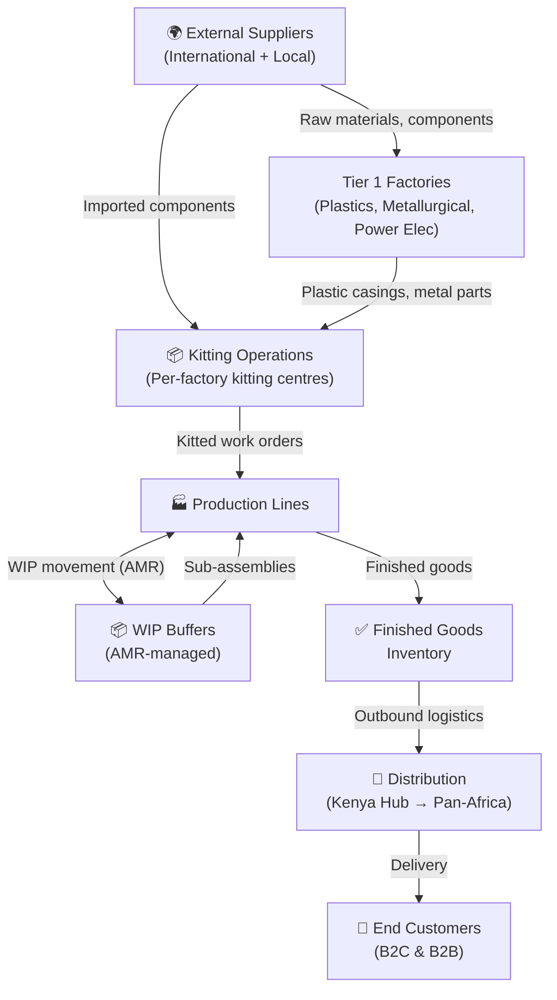
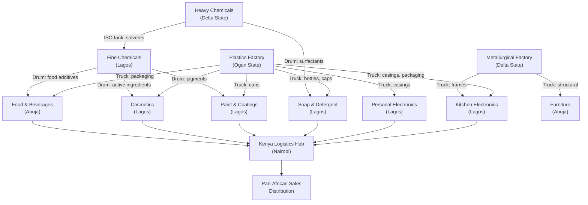

# Supply Chain Strategy

## Overview

Coo-Cah's supply chain strategy is built around four core principles:

1. **Progressive localisation** — Start with imported materials; systematically replace with locally or group-manufactured inputs over time
2. **Vertical integration** — Tier 1 factories (plastics, metallurgical) feed all other verticals, reducing external dependency
3. **Lean & pull** — Kanban-driven replenishment signals minimise inventory holding costs
4. **Resilience** — Dual-sourcing for critical materials, strategic buffer stocks for high-risk SKUs

---

## Supply Chain Architecture



---

## Sourcing Strategy

### Phase 1: Import-Heavy, Qualify-Local

In Phase 1, the supply chain is deliberately simple. Most components are imported from established global suppliers. Simultaneously, a local supplier qualification programme begins to identify African alternatives.

**Key import categories (Phase 1):**
- Semiconductor ICs (microcontrollers, power management, communication chips)
- Display panels (LCD, OLED) — primarily from South Korea, China
- Precision mechanical components (bearings, actuators, connectors)
- Specialty chemicals (surfactants, active ingredients, pigments)
- Lithium cells (for power banks and BESS) — primarily from China/South Korea

**Local/regional sourcing targets (Phase 1):**
- Agricultural raw materials (food & beverages): 80% local from Nigerian/Kenyan farms
- Plastic granules: 50% from Nigeria (INDORAMA polymers, ELEME Petrochemicals)
- Aluminium: 30% from local traders / Nigerian Aluminium Extrusion Company (NAEXCO)
- Packaging materials (cartons, labels): 90% local

### Phase 2: Vertical Integration Begins

Phase 2 activates the Tier 1 group factories, which begin supplying plastic casings and metal parts to all other factories. This dramatically reduces the cost of externally sourced packaging and structural components.

**Key sourcing shifts (Phase 2):**
- Plastic casings: Transition from imported → Coo-Cah Plastics Factory (internal)
- Metal frames and brackets: Transition from imported → Coo-Cah Metallurgical (internal)
- Power management ICs: Begin transition to Project Baobab PMIC (internal) for select products
- Fine chemicals and pigments: Fine Chemicals factory begins supplying Paint & Cosmetics factories

### Phase 3: Maximum Local Content

By Phase 3, the group targets ≥ 60% African local content by value across all products.

**Localisation targets (Phase 3):**

| Category | Phase 1 Local % | Phase 3 Target |
|----------|----------------|----------------|
| Structural plastics | 10% | 95% (Coo-Cah Plastics) |
| Metal components | 15% | 70% (Coo-Cah Metallurgical + local) |
| Packaging | 50% | 90% |
| Food raw materials | 80% | 95% |
| Chemicals / surfactants | 20% | 65% (Coo-Cah Chemicals) |
| Semiconductor ICs | 0% | 25% (Project Baobab) |
| Overall local content (value) | ~25% | ≥ 60% |

---

## Kitting Operations

Kitting is the process of pre-assembling all components required for a specific production work order into a single kit — delivered to the production line when needed, reducing search time, staging errors, and line-side inventory.

### Kitting Process Flow

```mermaid
sequenceDiagram
    participant MES as MES System
    participant WMS as Warehouse Mgmt System
    participant KITTER as Kitting Operator / Cobot
    participant AMR as AMR Fleet
    participant LINE as Production Line

    MES->>WMS: Work order released (BOM + quantity)
    WMS->>KITTER: Kitting task dispatched
    KITTER->>WMS: Components picked and verified (RFID/barcode)
    KITTER->>AMR: Kitted tote loaded on AMR
    AMR->>LINE: Tote delivered to line-side buffer
    LINE->>MES: Confirm kit received; production begins
    MES->>WMS: BOM consumption posted
```

### Kitting Centre Layout (Per Factory)
Each major factory has a dedicated kitting centre adjacent to the main warehouse, equipped with:
- **Goods-to-Person (G2P) picking system** — AMRs bring shelving units to pick stations
- **Pick-to-Light systems** — LED indicators guide operators to correct bin
- **RFID verification gates** — Tote contents verified before dispatch to production
- **Cobot kitting stations** (Phase 2+) — For high-volume, repeatable kits

---

## Intra-Factory Logistics (AMR-Driven)

In Phase 2 and Phase 3, intra-factory material movement is primarily handled by the AMR fleet. The AMR routing system integrates with the MES to:

1. Receive transport task requests (from MES work orders or automated kanban signals)
2. Assign tasks to available AMRs based on proximity and priority
3. Navigate dynamically to source location (avoiding humans and obstacles)
4. Confirm collection (barcode/RFID scan)
5. Navigate to destination location
6. Confirm delivery (barcode/RFID scan at destination)
7. Return to charging station or await next task

### AMR Routing Zones

Each factory floor is divided into routing zones to manage traffic and prioritise critical flows:

| Zone | Priority | Description |
|------|----------|-------------|
| Zone A (Lines) | Highest | Active production line replenishment |
| Zone B (WIP) | High | Inter-station WIP transfer |
| Zone C (Staging) | Medium | Kitting pick-up and finished goods staging |
| Zone D (Warehouse) | Normal | Replenishment from warehouse to kitting |
| Zone E (Waste) | Low | Scrap and waste collection routes |

---

## Cross-Factory Material Flows



### Cross-Factory Logistics Modes

| Route | Distance | Mode | Transit Time |
|-------|----------|------|-------------|
| Ogun → Lagos (plastics) | ~80 km | Road (dedicated trailer) | Same day |
| Delta → Lagos (chemicals) | ~340 km | Road (ISO tank / dry van) | 1 day |
| Lagos → Abuja (consumer goods) | ~760 km | Road (articulated truck) | 1–2 days |
| Lagos/Abuja → Nairobi (Kenya hub) | ~4,000 km | Air freight (express) or sea | 2 days (air) / 14 days (sea) |

---

## Supplier Management

### Supplier Tiers
- **Tier A — Critical Strategic Suppliers:** Single-source or dominant suppliers for critical inputs. Annual business reviews, quarterly KPI tracking, senior executive relationships.
- **Tier B — Standard Strategic Suppliers:** Dual-sourced. Semi-annual reviews. Formal scorecard.
- **Tier C — Spot/Commodity Suppliers:** Competitive bidding. No long-term contracts.

### Supplier KPI Scorecard

| KPI | Tier A Target | Tier B Target |
|-----|-------------|--------------|
| On-Time Delivery (OTD) | ≥ 98% | ≥ 95% |
| Quality (PPM defect rate) | < 500 PPM | < 2,000 PPM |
| Fill Rate | ≥ 99% | ≥ 97% |
| Documentation completeness | 100% | ≥ 98% |
| Sustainability (ESG score) | ≥ 75/100 | ≥ 60/100 |

---

## Inventory Targets

| Inventory Category | Phase 1 Target | Phase 3 Target |
|-------------------|---------------|----------------|
| Raw material days of supply | 30–45 days | 10–15 days |
| WIP (days) | 5–7 days | 1–2 days |
| Finished goods (days) | 15–30 days | 5–10 days |
| Slow-moving/obsolete (% of total) | < 5% | < 2% |

---

*See also: [Smart Factory Core](../05-smart-factory-core/index.md) | [AI Platform](../08-ai-platform/index.md) | [Factory Verticals](../03-factories/index.md)*
