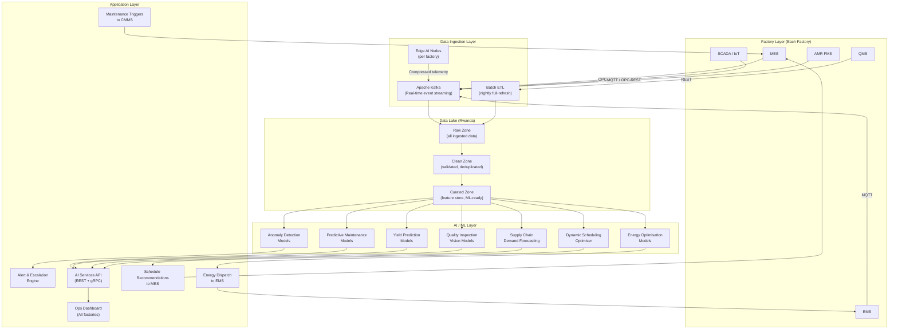

# Central AI Platform Architecture

## Overview

The Coo-Cah Central AI Platform is the intelligence layer that spans all factories, all countries, and all operational domains. Hosted and operated by **Coo-Cah Rwanda OpCo** (Rwanda AI Platform Team), it aggregates data from every factory, trains and deploys machine learning models, and delivers real-time optimisation decisions back to each facility.

> **Principle:** The AI platform does not replace factory systems (MES, EMS, WMS) — it augments them. It consumes their data, learns from it, and injects intelligence back to improve decisions.

---

## Platform Architecture



---

## Data Lake Schema

### Zone Definitions

| Zone | Description | Retention | Format |
|------|-------------|-----------|--------|
| **Raw** | All data exactly as received from source systems | 7 years | Parquet, JSON, CSV |
| **Clean** | Validated, deduplicated, schema-enforced data | 5 years | Parquet (partitioned) |
| **Curated** | Aggregated features, ML-ready datasets, domain models | 3 years | Parquet, Delta Lake |
| **Serving** | Low-latency tables for dashboard queries | 90 days | Apache Iceberg |

### Core Data Domains

#### 1. Production Domain
```
production/
├── work_orders/          # MES work orders (planned vs actual)
├── production_runs/      # Actual production events
├── oee_metrics/          # Availability, performance, quality by line/shift
├── cycle_times/          # Per-unit cycle time tracking
└── line_status/          # Real-time line state changes
```

#### 2. Quality Domain
```
quality/
├── inspection_results/   # In-process and final inspection data
├── defect_classifications/ # Defect type, severity, root cause
├── spc_charts/           # Statistical Process Control data points
├── ncrlog/               # Non-conformance records
└── yield_by_product/     # FPY, final yield per SKU per run
```

#### 3. Maintenance Domain
```
maintenance/
├── asset_telemetry/      # Vibration, temperature, current per asset (time-series)
├── work_orders/          # CMMS maintenance work orders
├── failure_events/       # Recorded failures with RCA
├── pm_schedule/          # Planned preventive maintenance records
└── parts_consumption/    # Spare parts used per asset
```

#### 4. Energy Domain
```
energy/
├── generation/           # Solar/wind generation by minute
├── consumption/          # Factory consumption by zone and machine
├── bess_state/           # Battery SOC, SOH, charge/discharge cycles
├── grid_exchange/        # Grid import/export records
└── cost/                 # Energy cost per kWh blended
```

#### 5. Supply Chain Domain
```
supply_chain/
├── purchase_orders/      # Inbound POs with status
├── goods_receipts/       # Received materials with quality inspection
├── inventory_levels/     # Real-time inventory by SKU and location
├── supplier_performance/ # OTD, quality PPM per supplier
└── demand_forecast/      # Forward-looking demand by SKU
```

---

## AI Models

### 1. Predictive Maintenance (PM) Models

**Purpose:** Predict asset failures before they occur, enabling planned maintenance to replace emergency repairs.

**Algorithm approach:**
- **Anomaly detection:** Isolation Forest, LSTM Autoencoder on vibration/temperature time-series
- **Remaining Useful Life (RUL) prediction:** Temporal Convolutional Networks (TCN) on sensor history
- **Classification:** XGBoost classifier trained on historical failure events + sensor signatures

**Input features:**
- Vibration (RMS, peak, kurtosis, frequency spectrum)
- Temperature (bearing, motor winding, ambient)
- Current draw (compared to baseline)
- Runtime hours since last maintenance
- Historical failure patterns for same asset class

**Output:**
- Probability of failure in next 24h / 72h / 7 days
- Recommended maintenance action
- Estimated Remaining Useful Life (hours)

**Accuracy targets:**
| Metric | Phase 2 Target | Phase 3 Target |
|--------|---------------|----------------|
| Precision (failure predicted correctly) | ≥ 85% | ≥ 92% |
| Recall (failures caught) | ≥ 80% | ≥ 90% |
| False positive rate | < 15% | < 8% |
| Lead time before failure (avg) | ≥ 48 hours | ≥ 96 hours |

### 2. Yield Prediction Models

**Purpose:** Predict the expected yield of a production run before it begins, allowing operators and schedulers to adjust parameters proactively.

**Algorithm approach:**
- Gradient Boosting (LightGBM) on historical production run features
- Sequence model (LSTM) for predicting yield degradation during long runs

**Input features:**
- Raw material batch quality metrics
- Process parameters (temperature, speed, pressure)
- Machine age and last maintenance date
- Shift (morning/afternoon/night)
- Environmental conditions (ambient temp, humidity)
- Historical yield for same product on same machine

**Output:**
- Predicted yield (%) for the upcoming run
- Confidence interval
- Top 3 factors most likely to reduce yield (with recommended corrective actions)

### 3. Dynamic Production Scheduling Optimiser

**Purpose:** Optimise production scheduling across all lines to maximise OEE, minimise changeover time, meet customer due dates, and balance energy demand.

**Algorithm approach:**
- Constraint satisfaction + genetic algorithm for initial schedule generation
- Reinforcement learning (PPO algorithm) for dynamic rescheduling in response to disruptions
- Mixed-Integer Linear Programming (MILP) for multi-factory resource allocation

**Input:**
- Open work orders (product, quantity, due date, priority)
- Machine availability (from MES + predictive maintenance forecasts)
- Changeover matrix (time to change from product A to product B on each machine)
- Raw material availability (from WMS)
- Energy price forecast (from EMS)
- Labour availability (from MES shift roster)

**Output:**
- Optimised production schedule (machine × time × work order)
- Estimated OEE impact of proposed schedule
- Alerts for schedule risks (due date violations, material shortages)

### 4. Energy Optimisation Models

**Purpose:** Minimise energy cost and carbon intensity while ensuring production targets are met.

**Algorithm approach:**
- Model Predictive Control (MPC) for BESS charge/discharge scheduling
- ML demand forecasting (Prophet + LSTM ensemble) for 24-72h ahead factory energy demand
- Linear optimisation for solar/wind/BESS/grid dispatch merit order

**Output:**
- 24-hour ahead energy dispatch plan (solar, wind, BESS, grid, generator)
- Real-time dispatch recommendations every 15 minutes
- Monthly energy optimisation report

### 5. Vision Quality Inspection Models

**Purpose:** Automated visual inspection of products and components to detect defects faster and more accurately than human inspectors.

**Algorithm approach:**
- Convolutional Neural Networks (CNN) for defect classification (ResNet-50, EfficientNet)
- Anomaly detection (PatchCore) for zero-shot defect detection on new products
- Instance segmentation (Mask R-CNN) for precise defect localisation

**Training data:**
- Each factory contributes labelled inspection images to the central training dataset
- Active learning: borderline predictions sent to human expert for labelling → continuous improvement

**Accuracy targets:**
| Product Type | Phase 2 Target (Accuracy) | Phase 3 Target |
|-------------|--------------------------|----------------|
| PCB assembly | ≥ 98.5% | ≥ 99.5% |
| Plastic casings | ≥ 97% | ≥ 99% |
| Consumer goods | ≥ 96% | ≥ 98.5% |
| Food products | ≥ 95% | ≥ 98% |

---

## Infrastructure

### Compute Stack (Rwanda AI Platform)
- **Primary:** On-premise GPU cluster (NVIDIA A100 / H100) in Kigali data centre
- **Secondary:** Cloud burst capacity (AWS / GCP) for peak training workloads
- **Edge nodes:** NVIDIA Jetson AGX Orin at each factory (local inference, reduce latency)

### Data Platform Stack
| Layer | Technology |
|-------|-----------|
| Streaming ingest | Apache Kafka + Kafka Connect |
| Batch ingest | Apache Airflow + dbt |
| Data lake storage | Apache Iceberg on S3-compatible object store |
| Query engine | Apache Spark + Trino |
| Feature store | Feast |
| ML experiment tracking | MLflow |
| Model serving | BentoML + NVIDIA Triton |
| Monitoring | Evidently AI (data drift) + Grafana |
| Orchestration | Apache Airflow |
| Version control (data) | Delta Lake |

### Security & Privacy
- All data encrypted at rest (AES-256) and in transit (TLS 1.3)
- Role-based access control (RBAC) on all data assets
- PII data (employee records) stored separately with enhanced access controls
- SOC 2 Type II audit planned for Year 3
- GDPR/African data protection compliance (NDPA Nigeria, Data Protection Bill Rwanda)

---

*See also: [Smart Factory Core](../05-smart-factory-core/index.md) | [Automation Phases](../06-automation-phases/index.md)*
