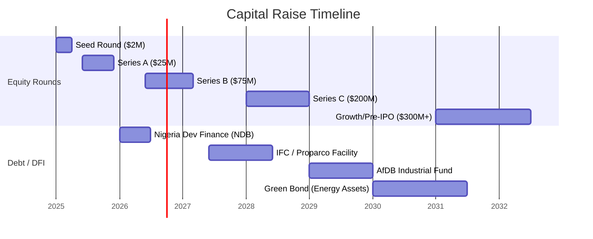

# Finance — CapEx/OpEx Framework & Investor Materials

## Overview

Coo-Cah's financial strategy is built on phased capital deployment, disciplined unit economics, and a partnership model with Development Finance Institutions (DFIs) and strategic investors. The group is structured to generate positive cash flows from Phase 1 operations that partially fund Phase 2 investments, reducing dependence on external capital over time.

---

## Capital Requirements Summary

### Total Group CapEx (10-Year Plan)

| Phase | Years | Group CapEx | Primary Allocation |
|-------|-------|------------|-------------------|
| Pre-Phase 1 (R&D + Pilot) | Y1 | $12M | Rwanda R&D hub, pilot lines, team |
| Phase 1 | Y1–Y3 | $85M | Nigeria Tier 1+2 factories, energy systems |
| Phase 2 | Y3–Y6 | $180M | Automation, Kenya hub, consumer goods |
| Phase 3 | Y6–Y10 | $350M+ | Full automation, Project Baobab, scale-out |
| **Total (Y1–Y10)** | | **~$627M+** | |

### Funding Rounds Roadmap

---

## Phase 1 CapEx Detail (Nigeria Priority Factories)

### Electronics Factories — Phase 1

| Factory | Land & Civil | Equipment | Energy System | Tech Stack | Total CapEx |
|---------|------------|----------|--------------|-----------|------------|
| Kitchen Electronics (Lagos) | $3.5M | $8M | $2.5M | $1.5M | **$15.5M** |
| Garage/Power Electronics (Ogun) | $2M | $5M | $3M | $1.2M | **$11.2M** |
| Personal Electronics (Lagos) | $2.5M | $6M | $2M | $1.5M | **$12M** |
| **Subtotal** | **$8M** | **$19M** | **$7.5M** | **$4.2M** | **$38.7M** |

### Chemicals/Plastics — Phase 1

| Factory | Land & Civil | Equipment | Energy System | Tech Stack | Total CapEx |
|---------|------------|----------|--------------|-----------|------------|
| Plastics Factory (Ogun) | $3M | $12M | $2M | $1M | **$18M** |
| **Subtotal** | **$3M** | **$12M** | **$2M** | **$1M** | **$18M** |

### Rwanda R&D Hub — Phase 1

| Item | CapEx |
|------|-------|
| Lab setup and equipment | $4M |
| IT infrastructure (AI platform, servers) | $3M |
| Team recruitment and relocation | $2M |
| Kigali Innovation City lease (5-year) | $2M |
| Pilot production line | $1M |
| **Total Rwanda** | **$12M** |

### Phase 1 Total: ~$68.7M

---

## Phase 2 CapEx Detail

### Automation Layer (All Phase 1 Factories)

| Item | Cost per Factory | Factories in Phase 2 | Total |
|------|----------------|---------------------|-------|
| AMR fleet (15 units avg) | $2.5M | 5 | $12.5M |
| Cobot stations (10 avg) | $1.8M | 5 | $9M |
| Advanced MES modules + AI integration | $0.8M | 5 | $4M |
| BESS capacity upgrade | $1.5M | 5 | $7.5M |
| Digital twin (line-level) upgrade | $0.5M | 5 | $2.5M |
| **Automation subtotal** | | | **$35.5M** |

### New Phase 2 Factories (Nigeria)

| Factory | Total CapEx |
|---------|------------|
| Consumer Goods: Food & Beverages (Abuja) | $22M |
| Consumer Goods: Soap & Detergent (Lagos) | $14M |
| Consumer Goods: Cosmetics (Lagos) | $12M |
| Consumer Goods: Paint & Coatings (Lagos) | $15M |
| Electronics: Smart Home/Office (Lagos) | $10M |
| Electronics: Security Electronics (Lagos) | $8M |
| Chemicals: Heavy Chemicals (Delta) | $35M |
| Chemicals: Fine Chemicals (Lagos) | $18M |
| **New factory subtotal** | **$134M** |

### Kenya Logistics Hub

| Item | CapEx |
|------|-------|
| Nairobi warehouse & logistics facility | $8M |
| Mombasa port operations setup | $4M |
| Nairobi EPZ assembly line | $6M |
| Kenya IT + EMS systems | $1.5M |
| **Kenya total** | **$19.5M** |

### Phase 2 Total: ~$189M

---

## Revenue Model

### Revenue Streams

| Stream | Description | Gross Margin Target |
|--------|-------------|---------------------|
| **Electronics manufacturing** | Direct sales of branded consumer electronics | 28–35% |
| **Consumer goods (FMCG)** | Food, beverages, soap, cosmetics, paint | 22–30% |
| **Chemicals B2B** | Industrial chemicals and plastics to third parties | 18–25% |
| **Contract manufacturing** | Third-party brands manufactured by Coo-Cah | 15–22% |
| **Energy services** | Excess solar/wind sold to grid or industrial neighbours | 20–30% |
| **IP licensing (from Year 8)** | ASIC and software IP licensed to third parties | 70–80% |
| **Shared services** | AI platform services to third-party African manufacturers | 60–70% |

### 5-Year Revenue Projections (Group)

| Year | Revenue | EBITDA | EBITDA Margin |
|------|---------|--------|--------------|
| Y1 | $5M | ($8M) | — (investment phase) |
| Y2 | $28M | ($2M) | — (near breakeven) |
| Y3 | $75M | $12M | 16% |
| Y4 | $140M | $28M | 20% |
| Y5 | $230M | $52M | 23% |
| Y7 | $450M | $112M | 25% |
| Y10 | $900M | $250M | 28% |

*Note: Projections are base-case estimates; subject to revision based on actual commissioning timelines.*

---

## Unit Economics — Key Factory Examples

### Kitchen Electronics Factory (Phase 1 Steady State)

| Metric | Value |
|--------|-------|
| Annual capacity (units) | 500,000 |
| Blended ASP (average selling price) | $120 |
| Annual Revenue | $60M |
| COGS (materials + labour + energy) | $78M at 65%; $42M at steady state |
| Gross Profit | $18M (30% margin at steady state) |
| Factory-level EBITDA | $12M |
| CapEx | $15.5M |
| Payback period | ~18 months at steady state |
| ROIC (5-year) | ~38% |

### Plastics Factory (Phase 1 Steady State)

| Metric | Value |
|--------|-------|
| Annual capacity (tonnes) | 15,000 tonnes |
| Blended revenue per tonne | $1,800 |
| Annual Revenue | $27M |
| EBITDA margin | 22% |
| CapEx | $18M |
| Payback period | ~36 months |

---

## OpEx Structure

### Factory Operating Cost Breakdown (Typical Phase 1 Factory)

| Cost Category | % of Revenue |
|--------------|-------------|
| Direct materials | 45–55% |
| Direct labour | 8–12% |
| Energy (blended, with renewables) | 4–8% |
| Maintenance | 2–4% |
| Factory overheads | 3–5% |
| Depreciation | 4–6% |
| **Total COGS** | **66–90%** (varies by phase) |
| SG&A | 6–10% |
| **EBITDA** | **10–28%** |

### Energy Cost Reduction over Phases

| Phase | Energy as % of Revenue | Driver |
|-------|----------------------|--------|
| Phase 1 | 6–8% | Solar + BESS + grid mix |
| Phase 2 | 4–5% | Higher renewable %, efficiency |
| Phase 3 | 2–3% | Near-full self-sufficiency |

---

## Financial KPIs & Reporting

### Group Financial KPIs

| KPI | Definition | Phase 1 Target | Phase 3 Target |
|-----|-----------|---------------|----------------|
| Revenue Growth Rate | YoY revenue growth | > 40% (early years) | > 20% |
| Gross Margin | Gross profit / Revenue | > 25% | > 35% |
| EBITDA Margin | EBITDA / Revenue | > 12% | > 28% |
| CapEx Intensity | CapEx / Revenue | < 25% | < 10% |
| Return on Invested Capital (ROIC) | NOPAT / Invested Capital | > 15% | > 25% |
| Net Debt / EBITDA | Leverage ratio | < 4× | < 2× |
| Cash Conversion Cycle (CCC) | DIO + DSO - DPO | < 45 days | < 30 days |
| Free Cash Flow margin | FCF / Revenue | > 5% | > 15% |

### Reporting Cadence

| Report | Frequency | Audience |
|--------|----------|---------|
| Factory P&L flash | Weekly | OpCo MD, Group CFO |
| Group management accounts | Monthly | Holdings Board |
| OpCo board pack | Monthly | OpCo Board |
| Investor KPI dashboard | Monthly | All investors |
| Audited financial statements | Annual | Regulatory + investors |
| ESG report | Annual | Holdings Board, public |
| Transfer pricing documentation | Annual | Tax authorities |

---

## DFI & Impact Investment Strategy

Development Finance Institutions (DFIs) are a priority funding source for Coo-Cah due to:
- Lower cost of capital compared to commercial debt
- Long-tenor financing aligned with factory payback periods
- Access to technical assistance grants
- Credibility signal to commercial co-investors

### Target DFI Partners

| Institution | Instrument | Focus Area |
|------------|-----------|-----------|
| International Finance Corporation (IFC) | Equity + mezzanine debt | Manufacturing, SME supply chain |
| African Development Bank (AfDB) | Project finance | Industrial infrastructure |
| Proparco (France) | Debt | Green manufacturing |
| British International Investment (BII) | Equity | Nigeria, Kenya |
| Development Bank of Nigeria (DBN) | Concessional debt | Nigeria manufacturing |
| East African Development Bank (EADB) | Project finance | Rwanda, Kenya |
| European Investment Bank (EIB) | Green loan | Energy systems |

### Impact Metrics for DFI Reporting

| Impact Area | Metric | Y5 Target |
|-------------|--------|-----------|
| Jobs created (direct) | Employees | 5,000+ |
| Jobs created (indirect) | Supply chain + community | 25,000+ |
| Women employed | % of workforce | ≥ 40% |
| Local procurement | % of inputs by value | ≥ 50% |
| CO₂ avoided | vs. equivalent grid-powered operations | 50,000 tonnes/year |
| Local skills training | Training hours per employee | ≥ 80 hours/year |
| SME suppliers developed | Number qualifying as Tier B suppliers | ≥ 200 |

---

*Finance queries: cfo@coocah.com | Investor relations: ir@coocah.com*
