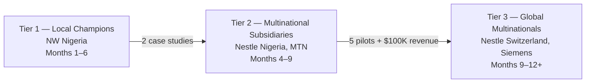

# External Factory Traction Strategy

> **Project Coo-Cah | Go-to-Market**
> **Document Version:** 1.0 | **Owner:** CEO / CRO
> **Purpose:** Define the external factory commercialisation strategy to achieve paid traction before Coo-Cah's own factories are commissioned.

---

## Why External First

Coo-Cah's own factories are not yet built. The Acceler8 Africa (AA) assessment (Score: **81/100 — MVP Refinement**) was explicit:

> *"The main gap is converting this strong internal validation into external, revenue-generating traction."*

An 8-year internal-only roadmap risks:

- Missing market shifts or competitor entry
- No gross margin data to calculate unit economics
- No paying customer validation before large CapEx is committed

**External-first is not a pivot — it is the only logical move given our current build stage.**

Our Edge AI predictive maintenance platform is deployable today on third-party factory floors. We carry our core competitive advantage — offline-first Edge AI that runs on a **$250–$350 pilot edge kit** in dust, heat, and unstable power — into factories that Siemens, SAP, and Honeywell cannot serve economically.

---

## Strategic Sequence

| Stage | Target Type | Sales Cycle | Deal Size | Goal |
|-------|-------------|-------------|-----------|------|
| Tier 1 | Mid-size NW Nigerian manufacturers | 30–60 days | ₦2M–₦5M / 6-month pilot | 3 case studies + uptime data |
| Tier 2 | Multinational African subsidiaries | 60–90 days | $20K–$50K pilot | 5 paying factories + $100K ARR |
| Tier 3 | Global HQ multinationals | 6–12 months | $100K–$500K SaaS | Enterprise deals |

---

## What We Sell Right Now

At **MVP Refinement** stage, the offer is narrow and low-risk for the customer:

1. **30-Day Free Sensor Trial** — install on 1 critical machine, measure failure signals, deliver a downtime risk report at the end of the month.
2. **6-Month Paid Pilot** — ₦2M–₦5M to instrument 1–3 production lines with Edge AI monitoring, weekly reports, and alert-to-maintenance workflow.
3. **Outcome guarantee** — if we don't demonstrate measurable downtime reduction, the customer pays nothing for the trial phase.

See [Pilot Offer](pilot-offer.md) for full commercial terms and [Raspberry Pi Pilot Deployment Profile](raspberry-pi-pilot-deployment-profile.md) for implementation details.

---

## Our Competitive Moat in This Market

| Competitor | Why They Lose in NW Nigeria |
|---|---|
| Siemens MindSphere | Requires AC server rooms, stable internet, and a 12-month procurement cycle |
| SAP Plant Maintenance | ERP-heavy, no edge, no offline mode, enterprise pricing out of reach |
| Honeywell | Requires certified SCADA installers and global support contracts |
| **Coo-Cah Edge AI** | Runs on Android tablet + $300 sensor kit. Works offline. Survives dust, heat, generator switchovers. Deployable in 3 days. |

Pitch in one sentence:
> *"Siemens software needs an AC room and stable power. Ours runs on ₦150K hardware and survives Gusau."*

---

## AA Traction Milestone

| Horizon | Target | Metric |
|---------|--------|--------|
| 6 months (Short Term) | 1 external paid pilot in Nigeria | Validate ₦2M–₦5M price point |
| 12 months (Medium Term) | 5 external factories, ₦10M MRR | Repeatable sales + deployment process |
| 24 months (Long Term) | 20+ factories in Nigeria and Kenya | $50K MRR — proves model beyond internal use |

---

*See also: [Pilot Offer](pilot-offer.md) · [Raspberry Pi Pilot Deployment Profile](raspberry-pi-pilot-deployment-profile.md) · [Target List](target-list.md) · [Outreach Playbook](outreach-playbook.md) · [90-Day Tracker](90-day-tracker.md)*
