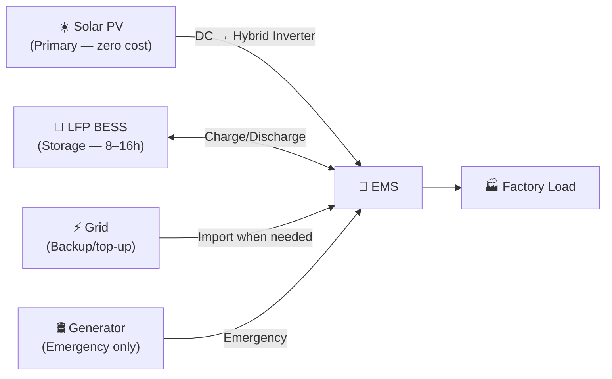
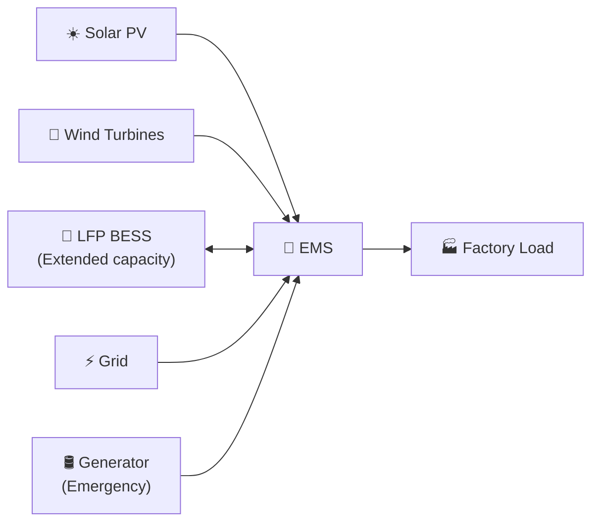
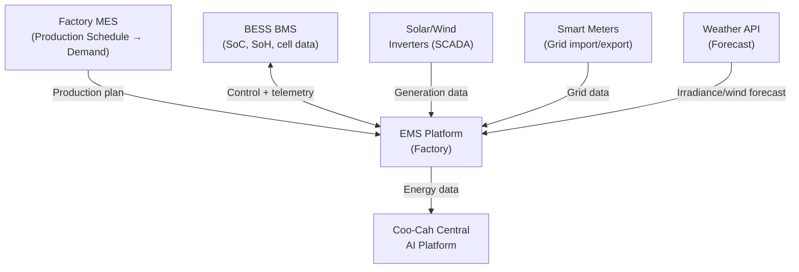

# Hybrid Energy Systems — Group Microgrid Design Standard

> **Project Coo-Cah | Energy Infrastructure**
> **Document Version:** 1.0 | **Owner:** Group Energy & Infrastructure Team

---

## Overview

A hybrid energy system combines two or more generation sources (solar PV, wind turbines, grid, generator) with battery energy storage, managed by an intelligent Energy Management System (EMS). Coo-Cah mandates hybrid systems at all factory sites to achieve energy resilience, cost optimisation, and progressive decarbonisation across the manufacturing network.

---

## System Configurations by Site Type

### Configuration A — Solar + BESS + Grid (Standard)

Applicable to: Most Nigeria urban/peri-urban factory sites.



**Suitable for:** Sites with good solar irradiance (PSH ≥ 4.5 hrs), unreliable grid, available roof/land area.

### Configuration B — Solar + Wind + BESS + Grid

Applicable to: Coastal and highland sites with viable wind resources.



**Suitable for:** Delta State (Nigeria coastal), Mombasa (Kenya), Rwanda highlands. Achieves higher renewable fraction due to complementary generation profiles.

### Configuration C — Solar + Wind + BESS + Biogas

Applicable to: Factories with organic waste streams (Food & Beverages, Baby Products, Personal Care).

Biogas is generated from organic production waste and used to fuel a CHP (Combined Heat and Power) unit, providing both electricity and process heat. This configuration can achieve ≥ 95% renewable energy fraction.

---

## EMS Architecture

The Coo-Cah Energy Management System (EMS) is a software platform deployed at every factory, integrated with the Central AI Platform for group-wide energy optimisation.

### EMS Components

| Component | Function |
|-----------|---------|
| **SCADA Layer** | Real-time data acquisition from all energy assets (solar inverters, BMS, smart meters, turbine controllers) |
| **Dispatch Engine** | Rule-based + AI merit-order dispatch algorithm |
| **Demand Forecaster** | ML model predicts factory energy demand 24–72 hours ahead using production schedule from MES |
| **Generation Forecaster** | Weather-API-driven solar irradiance and wind speed forecast (48-hour horizon) |
| **Fault Detector** | Anomaly detection on inverters, battery cells, grid meters, turbine vibration |
| **Reporting Module** | Automated monthly energy reports for OpCo management and Holdings treasury |
| **API Gateway** | Pushes energy data to Coo-Cah Central AI Platform for group-level optimisation |

### EMS Integration Points



---

## BESS Sizing Standard

Battery Energy Storage Systems at all Coo-Cah factories use LFP (Lithium Iron Phosphate) chemistry exclusively.

### Why LFP?

| Property | LFP Advantage |
|----------|---------------|
| Safety | No thermal runaway risk with phosphate cathode; no cobalt |
| Cycle Life | ≥ 3,500 cycles @ 80% DoD (vs. ~1,000 for NMC) |
| Operating Temperature | Tolerant of high ambient temperatures — critical for Nigeria |
| Supply Chain | No cobalt dependency; ethically cleaner supply chain |
| Cost | Competitive $/kWh at utility scale (2024: ~$90–110/kWh) |

### BESS Sizing Formula

```
Usable BESS Capacity (kWh) =
    (Overnight Base Load kW × Overnight Hours hrs)
    + (Morning Pre-Solar Ramp kW × 2 hrs)
    + (Grid Outage Reserve kWh)
    ÷ Depth of Discharge (0.80 for LFP)
    ÷ Round-Trip Efficiency (0.95)
```

### BESS Size by Factory Category

| Factory Category | Typical Peak Load | Recommended BESS | Autonomy at Base Load |
|-----------------|-------------------|-----------------|----------------------|
| Small (< 5,000 m²) | 100–200 kW | 300–500 kWh | 8 hrs |
| Medium (5,000–12,000 m²) | 200–400 kW | 500–800 kWh | 10 hrs |
| Large (12,000–20,000 m²) | 400–700 kW | 800–1,200 kWh | 12 hrs |
| Extra Large (> 20,000 m²) | 700–1,500 kW | 1,200–2,500 kWh | 16 hrs |

### Preferred BESS Suppliers

| Supplier | Chemistry | Form Factor | Notes |
|----------|-----------|------------|-------|
| CATL (EnerOne/EnerC) | LFP | 19" rack, containerised | Tier 1 global supplier |
| BYD (Battery-Box) | LFP | Modular rack | Widely available |
| Pylontech (US series) | LFP | 19" rack | Cost-effective for < 500 kWh |
| REPT Battero | LFP | Containerised | Emerging Tier 1 |

---

## Grid Interface Standard

All Coo-Cah hybrid systems maintain a grid connection even where primary generation is renewable:

| Parameter | Specification |
|-----------|--------------|
| Grid Connection | Required at all sites; minimum 20% of peak load as contracted demand |
| Smart Meter | Bidirectional smart meter required for net metering / ToU tariff optimisation |
| Power Quality | Power factor ≥ 0.95; THD < 5% at point of common coupling |
| Grid Code Compliance | IEEE 1547-2018 or country equivalent (NERC Grid Code for Nigeria) |
| Islanding | Anti-islanding protection on all inverters (per IEC 62116) |
| ATS Response | Automatic Transfer Switch — < 100 ms switchover time for critical loads |

---

## Load Shedding Priority Tiers

When energy is constrained, the EMS sheds loads in the following priority order:

| Priority | Tier | Systems | Min Sustain Time |
|----------|------|---------|-----------------|
| P1 — Critical | Never shed | IT/MES servers, fire alarm, CCTV, emergency lighting | 24 hrs via BESS |
| P2 — Essential | Shed last | Assembly lines, QC equipment, cleanroom HVAC | 8 hrs via BESS |
| P3 — Important | Shed if needed | Packaging, warehousing, office HVAC | 4 hrs via BESS |
| P4 — Deferrable | Shed first | Non-production HVAC zones, EV charging, canteen | Immediate |

---

## Group Energy KPIs

| KPI | Phase 1 Target | Phase 2 Target | Phase 3 Target |
|-----|---------------|----------------|----------------|
| % Energy from Renewables (group) | ≥ 40% | ≥ 65% | ≥ 90% |
| Grid dependency (% of total energy) | < 60% | < 35% | < 10% |
| Generator usage (hrs/month, per factory) | < 48 hrs | < 12 hrs | < 2 hrs |
| Energy cost ($/kWh blended, group avg) | < $0.14 | < $0.10 | < $0.07 |
| Carbon intensity (kgCO₂/MWh, group) | < 200 | < 100 | < 20 |
| BESS round-trip efficiency (group avg) | ≥ 92% | ≥ 94% | ≥ 95% |
| Solar system availability (group avg) | ≥ 97% | ≥ 98% | ≥ 99% |
| Energy cost as % of CoGS (group avg) | < 12% | < 8% | < 5% |

---

*See also: [Solar Power Bank](../solar-power-bank/README.md) | [Wind Power Bank](../wind-power-bank/README.md) | [Energy Strategy](../../02-energy-strategy/index.md)*
