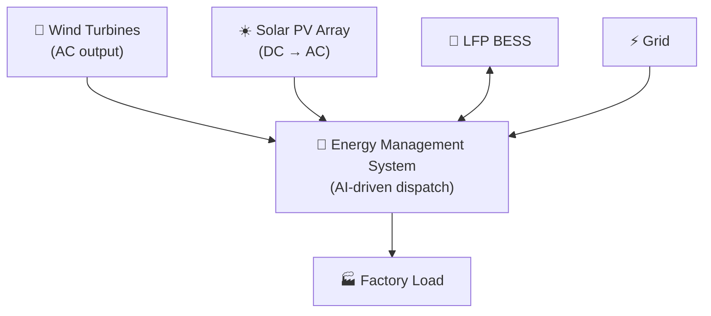

# Wind Power Bank — Group Wind Energy Programme

> **Project Coo-Cah | Energy Infrastructure**
> **Document Version:** 1.0 | **Owner:** Group Energy & Infrastructure Team

---

## Overview

The Coo-Cah Wind Power Bank covers the assessment, procurement, and operation of wind turbine systems at Coo-Cah factory sites where wind resources meet minimum viability criteria. Wind energy complements solar PV by generating power during low-irradiance periods (overcast days, early morning, evening), improving overall renewable self-sufficiency.

!!! note "Wind Is Site-Selective"
    Not all Coo-Cah factory locations are suitable for wind energy. Wind systems are only deployed at sites with a verified annual average wind speed ≥ 5.5 m/s at hub height, following a formal wind resource assessment.

---

## Wind Eligibility Criteria

A site is considered viable for wind energy deployment if it meets **all** of the following:

| Criterion | Minimum Requirement |
|-----------|-------------------|
| Average wind speed at hub height | ≥ 5.5 m/s (annual average) |
| Wind speed data source | ≥ 12 months of on-site anemometer data OR validated ERA5/MERRA-2 reanalysis data |
| Fetch (upstream clearance) | No major obstruction within 10× rotor diameter in prevailing wind direction |
| Environmental & community assessment | Cleared for noise, shadow flicker, bird/bat impact |
| Land/roof structural capacity | Structural engineer sign-off for turbine foundation loads |
| Regulatory path | Generation licence obtainable within project timeline |

---

## Eligible Sites (Current Assessment)

| Site | Location | Wind Resource | Assessment Status | Recommended System |
|------|----------|--------------|------------------|-------------------|
| Fertilizer Factory | Delta State (coastal) | Est. 5.8–6.2 m/s | Pre-feasibility | 3× 100 kW HAWT |
| Heavy Chemicals | Delta State (coastal) | Est. 5.7–6.0 m/s | Pre-feasibility | 2× 100 kW HAWT |
| Garage/Power Electronics | Ogun State | Est. 5.0–5.5 m/s | Borderline — anemometer required | TBD after data |
| Smart Estate/City Factory | Kigali Rwanda Highlands | Est. 5.5–6.5 m/s | Pre-feasibility | 1–2× 50 kW HAWT |
| Kenya Logistics Hub | Nairobi Kenya | Est. 5.3–5.8 m/s | Pre-feasibility | TBD after data |

---

## Turbine Technology Specification

### Small Wind (< 100 kW)

Applicable to sites with limited land, moderate wind resources, or where grid connection is absent.

| Parameter | Specification |
|-----------|--------------|
| Type | Horizontal Axis Wind Turbine (HAWT) |
| Rated Power | 20 kW – 100 kW per unit |
| Hub Height | 24 m – 40 m |
| Rotor Diameter | 14 m – 30 m |
| Cut-in Wind Speed | 2.5–3.5 m/s |
| Rated Wind Speed | 11–13 m/s |
| Cut-out Wind Speed | 25 m/s |
| Annual Energy Yield | ~80,000–400,000 kWh/year (at 5.5 m/s site) |
| Preferred Suppliers | Enercon E-33, Vestas V27, Turbowind T400 |

### Medium Wind (100 kW – 2 MW)

For higher-resource coastal or highland sites where land is available and grid connection exists.

| Parameter | Specification |
|-----------|--------------|
| Type | Grid-scale HAWT |
| Rated Power | 250 kW – 2 MW per unit |
| Hub Height | 50 m – 80 m |
| Rotor Diameter | 33 m – 90 m |
| Annual Energy Yield | ~600,000 kWh – 5 MWh/year (at 6 m/s site) |
| Grid Compliance | Full grid-forming capability, LVRT, power factor control |
| Preferred Suppliers | Vestas, Enercon, Siemens Gamesa |

---

## Wind Resource Assessment Process

```
Step 1: Desktop study
        - Download ERA5/MERRA-2 reanalysis data for site coordinates
        - Calculate Weibull wind distribution parameters (k, c)
        - Estimate P50 and P90 annual energy production (AEP)

Step 2: On-site measurement campaign (minimum 12 months)
        - Install calibrated anemometer at intended hub height
        - Record 10-minute interval wind speed, direction, and temperature data
        - Correlate with long-term reference data to produce Measure-Correlate-Predict (MCP)

Step 3: Wake and turbulence analysis
        - Model turbine array wake losses using WindFarmer or WAsP
        - Assess turbulence intensity for turbine class selection

Step 4: Energy yield assessment
        - Calculate Net Annual Energy Production (AEP) at P50 and P90 confidence
        - Apply losses: wake, availability, electrical, curtailment

Step 5: Financial viability
        - Calculate LCOE (Levelised Cost of Energy)
        - Compare with grid tariff and solar LCOE
        - Decision: proceed / defer / abandon
```

---

## Hybrid Integration

Wind turbines at Coo-Cah sites are always integrated into the factory's hybrid energy system alongside solar PV and BESS. The EMS manages the combined dispatch:



The EMS priority order for wind + solar sites:
1. Solar PV output (zero marginal cost, predictable)
2. Wind turbine output (zero marginal cost, intermittent)
3. BESS discharge (if SoC > 20%)
4. Grid import (if available and below price threshold)
5. Generator (emergency only)

---

## Performance KPIs

| KPI | Target | Frequency |
|-----|--------|-----------|
| Wind Turbine Availability | ≥ 97% | Monthly |
| Capacity Factor | ≥ 25% (small HAWT at qualifying sites) | Annual |
| P50 AEP Attainment | ≥ 90% | Annual |
| Wind Contribution to Total Energy | ≥ 15% (qualifying sites) | Monthly |
| Turbine Uptime (unplanned stops) | < 50 hrs/year | Annual |
| Grid Carbon Offset from Wind | Tracked & reported | Annual |

---

## Regulatory Notes

### Nigeria
- NERC embedded generation licence required for installations > 1 MW
- Environmental Impact Assessment (EIA) required for turbines > 100 kW
- Community consultation required per NESREA guidelines

### Rwanda
- RURA generation licence for systems > 50 kW
- Rwanda Environment Management Authority (REMA) environmental assessment

### Kenya
- EPRA licence for embedded generation
- NEMA Environmental Impact Assessment for turbines > 100 kW

---

*See also: [Solar Power Bank](../solar-power-bank/README.md) | [Hybrid Systems](../hybrid-systems/README.md) | [Energy Strategy](../../02-energy-strategy/index.md)*
