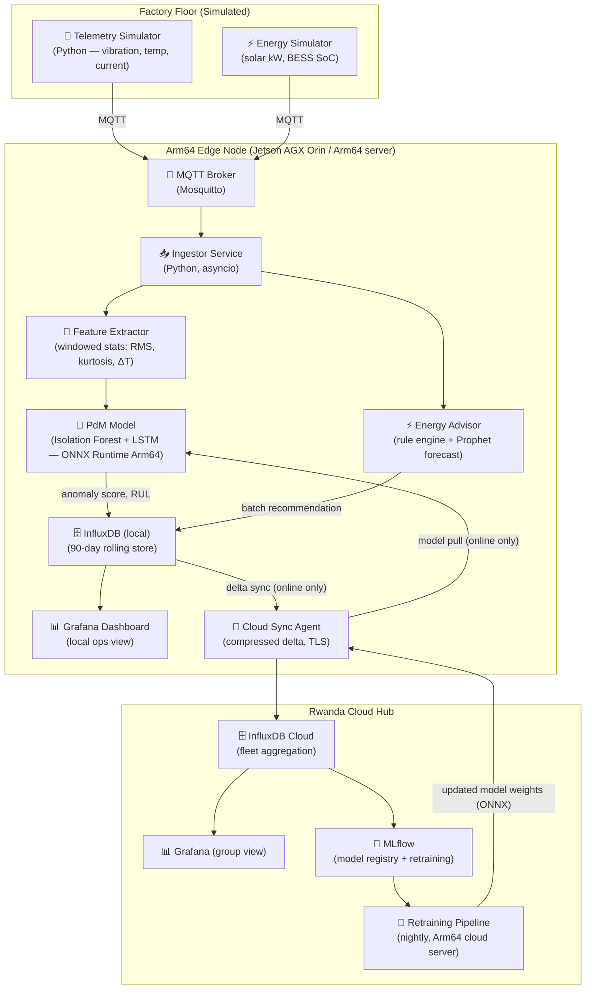

# Demo Architecture Plan — Coo-Cah Edge Twin for Arm

> **Document Type:** Hackathon Build Plan  
> **Scope:** Personal Electronics pilot factory — SMT line, Sagamu, Nigeria  
> **Arm Target:** Arm64 edge node (NVIDIA Jetson AGX Orin or Arm64 server)  
> **Status:** ACTIVE — Build phase

---

## 1. System Overview



---

## 2. Component Specifications

### 2.1 Telemetry Simulator

Generates realistic sensor streams for 2 machines on the Personal Electronics SMT line:

| Machine | Sensors | Nominal Range | Failure Mode |
|---------|---------|--------------|-------------|
| SMT pick-and-place robot | Vibration (X/Y/Z RMS), motor current | 0.1–0.4 g, 2–4 A | Bearing wear → vibration ↑ + current ↑ |
| Reflow oven | Zone temperatures (zones 1–8), conveyor motor current | 150–260 °C, 1.5–3 A | Heating element degradation → temp variance ↑ |

Simulator injects a **controlled bearing-wear degradation** scenario (gradual vibration increase over 72 hours culminating in simulated failure) to demonstrate fault prediction lead time.

**Technology:** Python (`numpy`, `paho-mqtt`), configurable via YAML.

---

### 2.2 MQTT Broker

| Parameter | Value |
|-----------|-------|
| Broker | Eclipse Mosquitto 2.x |
| Protocol | MQTT 5.0 |
| Topics | `coocah/pe-sagamu/{asset_id}/telemetry` |
| QoS | 1 (at least once) |
| Retain | Off (real-time only) |
| Auth | Username/password + TLS (self-signed CA for demo) |

Conforms to the group MQTT Topic Schema (`platform/mqtt-topic-schema.md`).

---

### 2.3 Ingestor Service

Subscribes to MQTT topics, validates payload schema, writes raw telemetry to InfluxDB, and passes windowed feature vectors to the Feature Extractor.

**Window:** 60-second tumbling window, triggered every 30 seconds (50% overlap).

---

### 2.4 Feature Extractor

Computes statistical features from each sensor window:

| Feature | Description |
|---------|-------------|
| RMS | Root mean square of vibration signal |
| Peak | Maximum absolute value in window |
| Kurtosis | Fourth statistical moment — sensitive to impulsive faults |
| Crest factor | Peak / RMS — increases with bearing spalling |
| ΔT | Temperature deviation from 15-minute rolling baseline |
| Current deviation | Current draw vs. 24-hour median for same operating state |

Output: 12-dimensional feature vector per machine per window.

---

### 2.5 PdM Model (Arm64-optimised)

**Stage 1 — Anomaly Detection:** Isolation Forest trained on 30 days of nominal operation data.  
**Stage 2 — RUL Estimation:** LSTM trained on bearing degradation patterns (PHM 2012 dataset + synthetic Coo-Cah data).

**Arm64 Optimisation:**

| Step | Detail |
|------|--------|
| Export format | ONNX (opset 17) |
| Quantisation | INT8 post-training quantisation via ONNX Runtime quantisation tool |
| Runtime | ONNX Runtime 1.17+ with ARM64 execution provider |
| Inference target | < 50 ms per 12-dim feature vector on Jetson AGX Orin |
| Batch size | 1 (streaming inference — no batching penalty) |

**Output per inference:**

```json
{
  "asset_id": "PE-SMT-PKP-01",
  "timestamp": "2026-07-16T10:00:00Z",
  "anomaly_score": 0.73,
  "anomaly_flag": true,
  "rul_hours": 52,
  "confidence": 0.81,
  "top_features": ["vibration_kurtosis", "current_deviation"],
  "recommended_action": "Schedule bearing inspection within 48 hours"
}
```

---

### 2.6 Energy Advisor

Reads the current BESS state-of-charge (SoC) and solar generation from the energy simulator. Applies a simple rule engine + 4-hour Prophet solar forecast to recommend whether to start the next production batch:

| Condition | Recommendation |
|-----------|---------------|
| BESS SoC ≥ 60% AND solar forecast ≥ planned load | ✅ Start batch — sufficient energy |
| BESS SoC 40–60% AND solar forecast adequate | ⚠️ Start batch — monitor BESS |
| BESS SoC < 40% OR solar forecast insufficient | ❌ Defer batch — await solar peak |

---

### 2.7 Local Dashboard (Grafana)

Three panels on a single Grafana page:

1. **Machine Health** — anomaly score timeline per machine; RUL countdown; active alert banner
2. **Sensor Telemetry** — live vibration RMS, temperature, current for each monitored machine
3. **Energy Status** — BESS SoC gauge, solar generation curve, batch-start recommendation banner

Grafana runs locally from InfluxDB edge — **no cloud dependency for dashboard operation**.

---

### 2.8 Cloud Sync Agent

Runs a background sync loop:

1. Checks connectivity every 60 seconds
2. If online: pushes compressed delta (1-minute aggregates, not raw samples) to Rwanda InfluxDB Cloud
3. If online: checks MLflow for new model versions; pulls updated ONNX weights if available
4. If offline: logs locally; delta queued for next online window

**Bandwidth:** ~ 2 KB/min per factory (compressed aggregates) vs. ~150 KB/min for raw MQTT stream — **≥ 98% bandwidth reduction** demonstrated.

---

## 3. Offline Resilience Demonstration

The demo explicitly shows the system operating without connectivity:

```
Demo step: disconnect the network cable on the edge node.

Expected behaviour:
- Grafana dashboard continues to update from local InfluxDB ✅
- PdM model continues inferencing from local MQTT ✅
- Anomaly alert fires locally for injected fault scenario ✅
- Cloud sync agent logs "offline — queuing delta" ✅
- Zero data loss — all telemetry written to local InfluxDB ✅

Demo step: reconnect the network cable.

Expected behaviour:
- Sync agent detects connectivity ✅
- Queued delta syncs to Rwanda cloud hub ✅
- Group Grafana dashboard updates ✅
```

---

## 4. Hardware Target

| Configuration | Hardware | Notes |
|--------------|----------|-------|
| **Full demo (preferred)** | NVIDIA Jetson AGX Orin 32 GB | Arm Cortex-A78AE + 2048-core Ampere GPU; matches production spec |
| **Cloud-equivalent demo** | AWS Graviton3 (c7g.xlarge) | Arm64 server; demonstrates same Arm64 software path |
| **Low-cost fallback** | Raspberry Pi 5 (8 GB) | Arm Cortex-A76; demonstrates edge-first concept with longer inference time |

Target inference latency benchmarks across hardware:

| Hardware | Isolation Forest (INT8) | LSTM (FP16) | Total per window |
|----------|------------------------|-------------|-----------------|
| Jetson AGX Orin | ~5 ms | ~20 ms | ~25 ms |
| Graviton3 (c7g.xlarge) | ~8 ms | ~35 ms | ~43 ms |
| Raspberry Pi 5 | ~15 ms | ~120 ms | ~135 ms |

All configurations satisfy the < 50 ms target on Jetson and Graviton.

---

## 5. Repository Structure (Demo Repo)

The demo will live in a dedicated GitHub repository linked from this master repo:

```
coo-cah-edge-twin-arm/
├── README.md                        ← Quick start guide
├── docker-compose.yml               ← One-command demo stack
├── simulator/
│   ├── telemetry_simulator.py       ← Sensor stream generator
│   └── energy_simulator.py         ← BESS + solar state generator
├── edge/
│   ├── ingestor/                    ← MQTT → InfluxDB + feature extraction
│   ├── model/
│   │   ├── train.py                 ← Model training (offline step)
│   │   ├── export_onnx.py          ← ONNX export + INT8 quantisation
│   │   └── pdm_model.onnx          ← Pre-trained model (checked in)
│   ├── energy_advisor/             ← Energy recommendation service
│   └── sync_agent/                 ← Cloud sync + model pull
├── dashboards/
│   └── grafana/
│       └── factory-ops.json        ← Grafana dashboard JSON
├── cloud/
│   └── mlflow_setup/               ← MLflow server config for Rwanda hub
├── docs/
│   └── arm-optimisation.md         ← Arm64 optimisation details
└── benchmarks/
    └── latency_benchmark.py        ← Hardware comparison script
```

---

## 6. Build Milestones

| Milestone | Deliverable | Owner |
|-----------|------------|-------|
| M1 | Telemetry simulator + MQTT ingestion working | AI Engineering |
| M2 | Isolation Forest model trained and exported to ONNX | AI Engineering |
| M3 | ONNX Runtime Arm64 inference pipeline working on edge hardware | AI Engineering |
| M4 | LSTM RUL model integrated; INT8 quantised | AI Engineering |
| M5 | Energy Advisor integrated with BESS/solar simulator | AI Engineering |
| M6 | Grafana local dashboard live; all 3 panels showing | Platform Engineering |
| M7 | Cloud sync agent working; offline/online demo scripted | Platform Engineering |
| M8 | End-to-end demo rehearsal; latency benchmarks recorded | Both teams |
| M9 | `docker-compose up` one-command demo confirmed on Arm64 | Both teams |
| M10 | Submission documentation complete | CTO |

---

## 7. Links to Group Standards

This demo conforms to the following Coo-Cah group standards:

| Standard | Reference |
|----------|-----------|
| MQTT topic schema | `platform/mqtt-topic-schema.md` |
| Asset ID naming | `platform/asset-id-naming-convention.md` |
| DT data model | `platform/digital-twin-data-model.md` |
| DT platform architecture | `platform/digital-twin-platform-architecture.md` |
| AI platform architecture | [`docs/08-ai-platform/index.md`](../08-ai-platform/index.md) |
| Personal Electronics factory | [`factories/electronics/personal-electronics/`](../factories/electronics/personal-electronics/README.md) |

---

*Coo-Cah Technologies Holdings — Arm AI Developer Challenge 2026 Demo Architecture*
