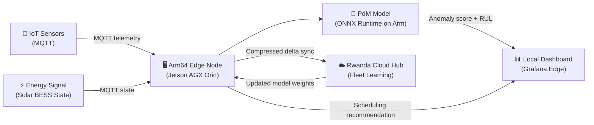

# Submission Concept Note — Coo-Cah Edge Twin for Arm

> **Hackathon Track:** Physical AI (primary) / Cloud AI (secondary)  
> **Submission Title:** Coo-Cah Edge Twin for Arm  
> **Organisation:** Coo-Cah Technologies Holdings  
> **Contact:** Group CTO, Coo-Cah Rwanda OpCo

---

## 1. Problem Statement

Africa's manufacturing sector accounts for less than 2% of global output despite having 30% of the world's mineral resources. A key barrier is the lack of **affordable, resilient, AI-powered factory operations** that work under African infrastructure conditions — intermittent internet, energy load-shedding, and tight capital budgets.

Existing cloud-native AI platforms assume always-on connectivity and cheap cloud compute. They do not work reliably in Nigerian industrial estates or Rwandan Special Economic Zones where connectivity is intermittent and cloud egress costs are high.

**Coo-Cah's answer:** Move AI inference to the factory edge, run it on efficient Arm-powered hardware, and sync intelligently to the cloud only when connectivity is available.

---

## 2. Solution

**Coo-Cah Edge Twin for Arm** is an edge-first AI system that:

1. Ingests real-time sensor telemetry from factory machines (vibration, temperature, current draw) via MQTT
2. Runs a **predictive maintenance model locally on an Arm64 edge node** — detecting anomalies and predicting failure risk without cloud dependency
3. Issues **energy-aware scheduling recommendations** — telling operators whether to start the next production batch based on solar generation and BESS state
4. Operates **fully offline** — the system continues making local decisions and logging data when internet is unavailable
5. **Syncs compressed summaries** to the Rwanda cloud hub when connectivity is restored — enabling fleet-wide learning across all Coo-Cah factories

---

## 3. Why Arm?

The system is purpose-built for Arm64 hardware because:

- **Energy efficiency:** Arm64 inference is 3–5× more energy-efficient than x86 equivalents — critical for solar-powered factories
- **Form factor:** Arm SBCs and embedded compute fit the compact industrial panel PC footprint required for factory edge nodes
- **Cost:** Arm64 servers (AWS Graviton, Ampere Altra) and embedded SoCs deliver cloud-tier compute at significantly lower cost, enabling the multi-factory rollout Coo-Cah needs
- **NVIDIA Jetson:** The Jetson AGX Orin (Arm-based) is already the designated inference accelerator in Coo-Cah's edge node spec

**Optimisations made for Arm:**

| Optimisation | Detail |
|--------------|--------|
| Model quantisation | INT8 / FP16 models via ONNX Runtime for Arm — reduces inference latency by ~40% vs. FP32 |
| ONNX Runtime ARM64 backend | Native Arm64 execution path; avoids x86 emulation overhead |
| Memory-mapped feature store | Efficient feature access on edge nodes with limited RAM |
| Lightweight MQTT pipeline | Mosquitto broker on edge — minimal CPU overhead for sensor ingestion |

---

## 4. Demo Scenario

**Factory:** Personal Electronics — SMT line, Sagamu, Nigeria (Phase 1 pilot factory)  
**Machines:** SMT pick-and-place robot + reflow oven  
**Data:** Simulated sensor streams (vibration RMS, bearing temperature, motor current)

### Demo Flow

**Step 1 — Normal operation:** Sensors show healthy baseline; edge dashboard green; no alerts.  
**Step 2 — Anomaly injection:** Simulated bearing degradation increases vibration RMS; model detects anomaly within one inference window (< 50 ms); alert fires on local dashboard.  
**Step 3 — RUL estimate:** Model predicts time-to-failure ≥ 48 hours; maintenance work order recommendation generated.  
**Step 4 — Energy recommendation:** BESS state drops below threshold; edge recommends deferring the next production batch by 2 hours until solar peaks; operator confirms on dashboard.  
**Step 5 — Offline mode:** Simulate internet outage; edge continues running inference and logging; no data lost; dashboard remains live.  
**Step 6 — Cloud sync:** Connectivity restored; compressed telemetry summaries and model feedback sync to Rwanda hub; fleet model updated.

---

## 5. KPI Story

| KPI | Target | Significance |
|-----|--------|--------------|
| Edge inference latency | < 50 ms per 60-second sensor window | Real-time operator feedback without cloud round-trip |
| Cloud bandwidth reduction | ≥ 80% vs. raw stream upload | Critical for expensive mobile/satellite connectivity in Africa |
| Fault prediction lead time | ≥ 48 hours before failure | Converts emergency maintenance to planned maintenance — reduces downtime |
| Energy recommendation accuracy | ≥ 85% correct decisions vs. manual baseline | Quantifiable energy cost saving per factory per year |

---

## 6. African Manufacturing Context

This is not a generic AI demo. It is a system designed for:

- **Intermittent connectivity:** Works offline; syncs when available
- **Energy sovereignty:** AI assists solar/BESS dispatch decisions, not just consumes power
- **Local data control:** Sensitive production data stays on-premises; only aggregated summaries go to cloud
- **Multi-factory replication:** Same Docker container stack deploys to all 17 planned Coo-Cah factories with factory-specific configuration only

---

## 7. Scalability Path

| Stage | Scope | AI Capabilities |
|-------|-------|----------------|
| **Hackathon demo (now)** | 1 factory, 2 machines, 1 model | PdM anomaly detection + energy signal |
| **Phase 1 pilot (Y1–Y3)** | 6 Tier 1 factories, all critical assets | PdM + Visual QC + energy optimisation |
| **Phase 2 (Y3–Y6)** | All 17 factories, full AI suite | + Dynamic scheduling + yield prediction |
| **Phase 3 (Y6–Y10)** | Cognitive autonomous factory | + Full autonomous dispatch + fleet RL |

---

## 8. Open-Source and Arm Ecosystem Alignment

**Implementation repository:** [oumar-code/arm-ai-optimizer](https://github.com/oumar-code/arm-ai-optimizer) — full source code, pre-trained ONNX models, Docker Compose stack, and benchmarks.  
**Architecture and strategy documentation:** [oumar-code/Coo-Kah-Doks](https://github.com/oumar-code/Coo-Kah-Doks)

| Component | Technology | Arm Relevance |
|-----------|-----------|---------------|
| Edge inference runtime | ONNX Runtime (Arm64 build) | Native Arm64 execution path |
| Model format | ONNX (INT8 quantised) | Arm NN compatible; Ethos-U NPU ready |
| Edge broker | Eclipse Mosquitto | Runs on Cortex-A at < 1% CPU |
| Time-series store | InfluxDB OSS | Arm64 binary available |
| Dashboard | Grafana OSS | Arm64 binary available |
| Container runtime | Docker (Arm64) | Full container portability |
| Cloud platform | Arm64 cloud server (Graviton / Ampere) | End-to-end Arm deployment |

---

*Coo-Cah Technologies Holdings — Arm AI Developer Challenge 2026 Submission*
