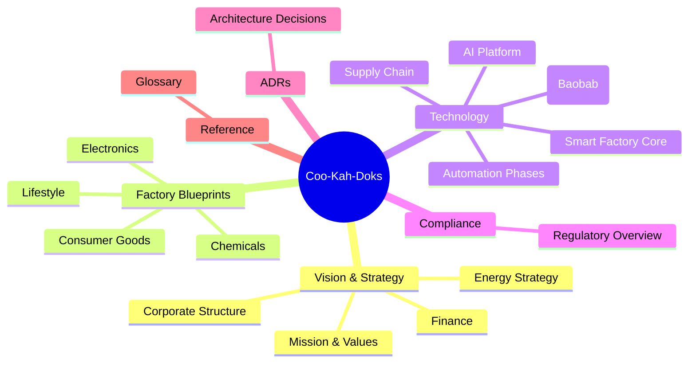
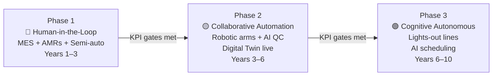
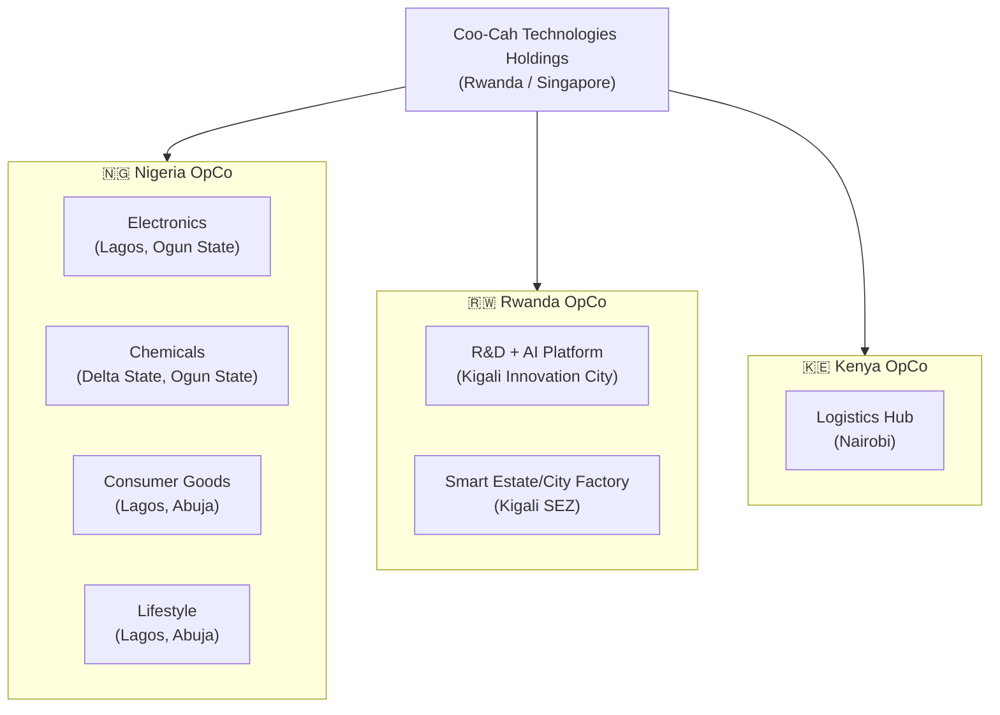

# Coo-Kah-Doks — Project Coo-Cah Blueprint

> **Building Africa's Industrial Future — One Smart Factory at a Time**

Welcome to the master documentation repository for **Project Coo-Cah**, the Coo-Cah Technologies Holdings manufacturing ecosystem blueprint. This site is the single source of truth for the design, architecture, and operational standards of all Coo-Cah smart factories across Nigeria, Rwanda, and Kenya.

---

## What Is Project Coo-Cah?

Project Coo-Cah is a vertically integrated, AI-powered manufacturing ecosystem that spans four industry verticals:

| Vertical | Factories | Focus |
|----------|-----------|-------|
| **Electronics** | 6 factories | Consumer electronics, smart home, security, power |
| **Chemicals** | 5 factories | Plastics, heavy & fine chemicals, fertilizer, metallurgical |
| **Consumer Goods** | 5 factories | Food & beverages, personal care, cleaning, packaged water, baby products |
| **Lifestyle** | 2 factories | Fashion & apparel, furniture & décor |

All factories share a common technology platform — MES, digital twin, AMR fleet, and the Coo-Cah Central AI Platform — and follow a three-phase automation roadmap from human-assisted production to fully autonomous, lights-out operation.

---

## How to Navigate This Documentation

### Quick Links

| Section | Description |
|---------|-------------|
| [Vision & Strategy](00-vision/index.md) | Mission, values, 10-year milestones, market opportunity |
| [Corporate Structure](01-corporate-structure/index.md) | Legal entities, governance, Holdings + OpCo model |
| [Energy Strategy](02-energy-strategy/index.md) | Solar, wind, BESS, hybrid systems, EMS |
| [Factory Blueprints](03-factories/index.md) | All factory verticals, tiers, dependency map |
| [Semiconductor — Baobab](04-semiconductor/index.md) | ASIC design, chip strategy, Project Baobab |
| [Smart Factory Core](05-smart-factory-core/index.md) | MES, OEE, quality, 5S principles |
| [Automation Phases](06-automation-phases/index.md) | Phase 1 → 3 roadmap, KPIs, milestones |
| [AI Platform](08-ai-platform/index.md) | Central AI architecture, use cases, data flows |
| [Supply Chain](07-supply-chain/index.md) | Procurement, logistics, cross-factory flows |
| [Compliance](09-compliance-regulatory/index.md) | Regulatory overview, certifications, permits |
| [Finance](10-finance/index.md) | CapEx/OpEx framework, investor materials |
| [ADRs](adrs/README.md) | Architecture Decision Records index |
| [Glossary](glossary.md) | Terms, abbreviations, and definitions |

---

## Three-Phase Automation Roadmap

---

## Factory Network Map

---

## Document Status

| Document Section | Status |
|-----------------|--------|
| Vision & Strategy | ✅ Complete |
| Corporate Structure | ✅ Complete |
| Energy Strategy | ✅ Complete |
| Factory Blueprints (all verticals) | ✅ Complete |
| Semiconductor (Baobab) | ✅ Complete |
| Smart Factory Core | ✅ Complete |
| Automation Phases | ✅ Complete |
| AI Platform | ✅ Complete |
| Supply Chain | ✅ Complete |
| Compliance & Regulatory | ✅ Complete |
| Finance | ✅ Complete |
| ADRs (001–006) | ✅ Complete |
| Glossary | ✅ Complete |

---

*Coo-Cah Technologies Holdings — Project Coo-Cah Blueprint Documentation*
*For questions: [architecture@coocah.com](mailto:architecture@coocah.com)*
