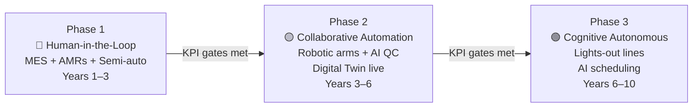
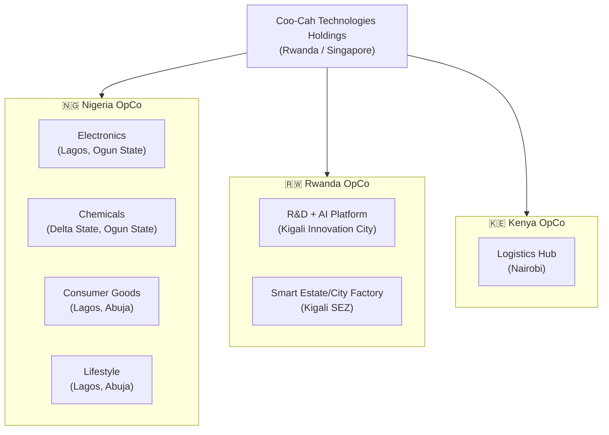

# Coo-Kah-Doks — Project Coo-Cah Blueprint

> **Building Africa's Industrial Future — One Smart Factory at a Time**

Welcome to the master documentation repository for **Project Coo-Cah**, the Coo-Cah Technologies Holdings manufacturing ecosystem blueprint. This site is the single source of truth for the design, architecture, and operational standards of all Coo-Cah smart factories across Nigeria, Rwanda, and Kenya.

---

## What Is Project Coo-Cah?

Project Coo-Cah is a vertically integrated, AI-powered manufacturing ecosystem that spans four industry verticals:

| Vertical | Factories | Focus |
|----------|-----------|-------|
| **Electronics** | 6 factories | Consumer electronics, smart home, security, power |
| **Chemicals** | 5 factories | Plastics, heavy & fine chemicals, fertilizer, metallurgical |
| **Consumer Goods** | 5 factories | Food & beverages, personal care, cleaning, packaged water, baby products |
| **Lifestyle** | 2 factories | Fashion & apparel, furniture & décor |

All factories share a common technology platform — MES, digital twin, AMR fleet, and the Coo-Cah Central AI Platform — and follow a three-phase automation roadmap from human-assisted production to fully autonomous, lights-out operation.

---

## Explore the Blueprint

-   :material-compass-outline:{ .lg .middle } **Vision & Strategy**

    ---

    Mission, values, 10-year milestones, and market opportunity across Africa.

    [:octicons-arrow-right-24: Explore](00-vision/index.md)

-   :material-office-building-outline:{ .lg .middle } **Corporate Structure**

    ---

    Legal entities, governance model, Holdings + OpCo architecture.

    [:octicons-arrow-right-24: Explore](01-corporate-structure/index.md)

-   :material-lightning-bolt-outline:{ .lg .middle } **Energy Strategy**

    ---

    Solar, wind, BESS, hybrid systems, and energy management systems.

    [:octicons-arrow-right-24: Explore](02-energy-strategy/index.md)

-   :material-factory:{ .lg .middle } **Factory Blueprints**

    ---

    All 18 factory verticals — Electronics, Chemicals, Consumer Goods, Lifestyle.

    [:octicons-arrow-right-24: Explore](03-factories/index.md)

-   :material-chip:{ .lg .middle } **Semiconductor — Baobab**

    ---

    ASIC design, chip strategy, and the Project Baobab foundry roadmap.

    [:octicons-arrow-right-24: Explore](04-semiconductor/index.md)

-   :material-cog-outline:{ .lg .middle } **Smart Factory Core**

    ---

    MES, OEE monitoring, quality management, and 5S principles.

    [:octicons-arrow-right-24: Explore](05-smart-factory-core/index.md)

-   :material-robot-industrial-outline:{ .lg .middle } **Automation Phases**

    ---

    Phase 1 → 3 roadmap, KPI gates, and milestone targets.

    [:octicons-arrow-right-24: Explore](06-automation-phases/index.md)

-   :material-brain:{ .lg .middle } **AI Platform**

    ---

    Central AI architecture, use cases, model governance, and data flows.

    [:octicons-arrow-right-24: Explore](08-ai-platform/index.md)

-   :material-truck-outline:{ .lg .middle } **Supply Chain**

    ---

    Procurement strategy, intra-factory logistics, and cross-factory flows.

    [:octicons-arrow-right-24: Explore](07-supply-chain/index.md)

-   :material-shield-check-outline:{ .lg .middle } **Compliance**

    ---

    Regulatory overview, gate readiness programmes, and DT execution.

    [:octicons-arrow-right-24: Explore](09-compliance-regulatory/index.md)

-   :material-currency-usd:{ .lg .middle } **Finance**

    ---

    CapEx/OpEx framework, funding model, and investor materials.

    [:octicons-arrow-right-24: Explore](10-finance/index.md)

-   :material-handshake-outline:{ .lg .middle } **External Factory Traction**

    ---

    Pilot offer, target factory list, outreach playbook, and 90-day tracker.

    [:octicons-arrow-right-24: Explore](11-external-factories/index.md)

-   :material-file-document-check-outline:{ .lg .middle } **Architecture Decisions**

    ---

    All ADRs — energy source, MES, digital twin, AMR, ERP, and AI platform.

    [:octicons-arrow-right-24: Explore](adrs/README.md)

-   :material-book-open-outline:{ .lg .middle } **Glossary**

    ---

    Terms, abbreviations, and definitions used across all documentation.

    [:octicons-arrow-right-24: Explore](glossary.md)

---

## Three-Phase Automation Roadmap

---

## Factory Network Map

---

## Document Status

| Document Section | Status |
|-----------------|--------|
| Vision & Strategy | ✅ Complete |
| Corporate Structure | ✅ Complete |
| Energy Strategy | ✅ Complete |
| Factory Blueprints (all verticals) | ✅ Complete |
| Semiconductor (Baobab) | ✅ Complete |
| Smart Factory Core | ✅ Complete |
| Automation Phases | ✅ Complete |
| AI Platform | ✅ Complete |
| Supply Chain | ✅ Complete |
| Compliance & Regulatory | ✅ Complete |
| Finance | ✅ Complete |
| ADRs (001–006) | ✅ Complete |
| Glossary | ✅ Complete |

---

*Coo-Cah Technologies Holdings — Project Coo-Cah Blueprint Documentation*
*For questions: [architecture@coocah.com](mailto:architecture@coocah.com)*
