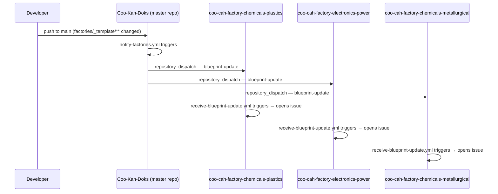

# Cross-Repo Orchestration Workflows

This page explains how **Coo-Kah-Doks** (the master repository) automatically notifies all
factory repos whenever the shared blueprint template is updated, and how factory repos receive
and track those notifications.

---

## Architecture



---

## Sender — `notify-factories.yml`

**Location:** `.github/workflows/notify-factories.yml` in this repo

**Triggers:**

- Automatically, when a push to `main` modifies any file under `factories/_template/`
- Manually, via **Actions → Notify Factory Repos of Blueprint Update → Run workflow**

**What it does:**

Uses the GitHub API to fire a `repository_dispatch` event with type `blueprint-update` at each
of the three active factory repos in parallel. The event payload carries the commit SHA, the
actor who pushed, and a human-readable reason so the receiving issue is fully traceable.

**Requires — secret `ORG_PAT`:**

The workflow uses a Personal Access Token (PAT) stored as a repository secret to authenticate
cross-repo API calls. Without this secret the workflow will fail immediately.

### How to create and add the PAT

1. Go to **GitHub → Settings → Developer settings → Personal access tokens → Fine-grained tokens** (or classic tokens with `repo` scope).
2. Create a token with **write access to Contents and Issues** on the three factory repos:
   - `oumar-code/coo-cah-factory-chemicals-plastics`
   - `oumar-code/coo-cah-factory-electronics-power`
   - `oumar-code/coo-cah-factory-chemicals-metallurgical`
3. Copy the token value.
4. Go to **Coo-Kah-Doks → Settings → Secrets and variables → Actions → New repository secret**.
5. Name: `ORG_PAT` — paste the token value — click **Add secret**.

---

## Receiver — `receive-blueprint-update.yml`

**Location (template):** `factories/_template/.github/workflows/receive-blueprint-update.yml`

**Triggers:** `on: repository_dispatch` with event type `blueprint-update`

**What it does:**

Opens a GitHub issue in the factory repo with a checklist prompting the maintainer to review the
master template diff and apply any relevant updates to that factory's own docs.

### How to install the receiver in each factory repo

The receiver workflow file must be present in each factory repo — it is provided here as a
template. Copy it once per factory:

1. In each factory repo, create the directory `.github/workflows/` if it does not already exist.
2. Copy `factories/_template/.github/workflows/receive-blueprint-update.yml` into that directory.
3. Commit and push to the factory repo's `main` branch.

The workflow uses only the built-in `GITHUB_TOKEN` — **no additional secrets are needed** in the
factory repos.

### Blueprint-sync label

The receiver workflow applies the label `blueprint-sync` to every issue it creates. Create this
label in each factory repo once:

```
gh label create "blueprint-sync" --color "0075ca" --description "Blueprint sync from master repo" \
  --repo oumar-code/coo-cah-factory-chemicals-plastics

gh label create "blueprint-sync" --color "0075ca" --description "Blueprint sync from master repo" \
  --repo oumar-code/coo-cah-factory-electronics-power

gh label create "blueprint-sync" --color "0075ca" --description "Blueprint sync from master repo" \
  --repo oumar-code/coo-cah-factory-chemicals-metallurgical
```

---

## Manual trigger

To send a blueprint-update notification without changing any template files:

1. Go to **Coo-Kah-Doks → Actions → Notify Factory Repos of Blueprint Update**.
2. Click **Run workflow**.
3. Optionally fill in a reason (e.g. `"Quarterly standards review Q2-2026"`).
4. Click **Run workflow** — one dispatch is sent to each factory repo.

---

## Factory repos covered

| Repo | Vertical |
|------|---------|
| [`coo-cah-factory-chemicals-plastics`](https://github.com/oumar-code/coo-cah-factory-chemicals-plastics) | Plastics & Polymers |
| [`coo-cah-factory-electronics-power`](https://github.com/oumar-code/coo-cah-factory-electronics-power) | Garage & Power Electronics |
| [`coo-cah-factory-chemicals-metallurgical`](https://github.com/oumar-code/coo-cah-factory-chemicals-metallurgical) | Metallurgical & Minerals |
