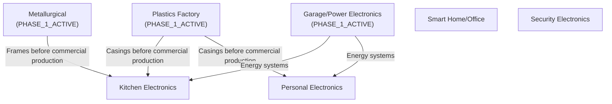

# Factory Status Registry

> **Project Coo-Cah | Orchestration**
> **Document Version:** 1.0 | **Owner:** Group Operations & Programme Management
> **Update Frequency:** Monthly

---

## Overview

This registry tracks the commissioning status of every Coo-Cah factory across all verticals and locations. It is the single source of truth for programme management, investor reporting, and cross-factory dependency planning.

For Gate 1 → 2 execution ownership, KPI closure, and evidence governance, use the companion playbook: [Gate 1 Readiness Program](./gate-1-readiness.md).

---

## Digital Twin Pilot Factory Designation (Gate 4 Decision)

> **Decision Date:** 2026-05-07
> **Decision Authority:** Group CTO
> **Owner:** Digital Twin Engineering Lead, Smart Factory Core Lead
> **Status:** CONFIRMED

**Designated DT Pilot Factory: Personal Electronics — Ogun State (Sagamu), Nigeria**

The Personal Electronics factory is formally designated as the **Phase 1 Digital Twin pilot factory** for the Coo-Cah group. This factory is the first proving ground for measurable DT value before Tier 1 rollout.

### Rationale

| Factor | Justification |
|--------|---------------|
| Phase 1 priority site | Provides immediate proving ground for execution and evidence capture |
| DT maturity | Most complete DT definition (asset registry, simulation use cases, maturity roadmap, governance/audit trail) |
| Instrumentation density | High data-point coverage and clear KPI targets (OEE, FPY, DPPM, energy intensity, MES completeness) |
| Cross-factory reuse potential | Electronics process learnings transfer quickly to Security and Kitchen factories |
| Alignment with standards-first rollout | Supports auditable evidence gating before Tier 1 release |

### DT Pilot Scope and Timeline

| Milestone | Target | Owner |
|-----------|--------|-------|
| Baseline capture + KPI contract lock | Days 0–30 | DT Lead + MES Product Owner + PMO |
| Controlled DT interventions | Days 31–60 | DT Engineering Lead + OT/IoT Lead |
| Independent audit + gate decision | Days 61–90 | Group CTO + PMO + Independent Reviewer |
| Tier 1 Wave 1 rollout | Post-gate | DT Engineering Lead |
| Tier 1 Wave 2 rollout | Post Wave 1 acceptance | DT Engineering Lead |

### Tier 1 Rollout Sequence

| Wave | Factories | Rollout Rule |
|------|-----------|--------------|
| Wave 1 | Security Electronics, Kitchen Electronics | Inherit pilot standards with local deltas only |
| Wave 2 | Remaining electronics factories + selected consumer-goods factories | Inherit standards-first package; no ad hoc divergence |

### Governance

- This designation is a Gate 4 decision and must not be changed without Group CTO approval and an updated ADR or formal change record.
- Progress against milestones is reviewed monthly in the Group Programme Management review.
- Evidence of pilot completion gates the Tier 1 rollout waves.

### Status Codes

| Code | Meaning |
|------|---------|
| `PLANNED` | Feasibility / design phase; no civil work commenced |
| `UNDER_CONSTRUCTION` | Civil works and/or equipment installation in progress |
| `COMMISSIONING` | Testing and qualification runs; production not yet commercial |
| `PHASE_1_ACTIVE` | Human-in-the-loop production; MES deployed; commercial production running |
| `PHASE_2_ACTIVE` | Collaborative automation active; robotic arms and AI QC deployed; digital twin live |
| `PHASE_3_ACTIVE` | Cognitive autonomous operation; lights-out lines certified |
| `ON_HOLD` | Delayed — awaiting capital, regulatory approval, or dependency |

---

## Electronics Vertical

| Factory | Location | Current Status | Phase 1 Start (Target) | Phase 2 Start (Target) | Phase 3 Start (Target) | Notes |
|---------|----------|---------------|----------------------|----------------------|----------------------|-------|
| Kitchen Electronics | Lagos, Nigeria | `PLANNED` | Q2 2026 | Q2 2028 | Q3 2031 | Phase 1 priority; Wave 1 Tier 1 rollout target |
| [Garage/Power Electronics](https://github.com/oumar-code/coo-cah-factory-electronics-power) | Ogun State, Nigeria | `PLANNED` | Q2 2026 | Q3 2028 | Q3 2031 | Phase 1 priority; energy-critical · **Dedicated repo live** |
| Personal Electronics | Ogun State, Nigeria | `PLANNED` | Q2 2026 | Q2 2028 | Q2 2031 | Phase 1 priority; SMT lines · ⭐ **DT Pilot Factory** (Gate 4 decision — see [DT Pilot Designation](#digital-twin-pilot-factory-designation-gate-4-decision)) |
| Smart Home & Office | Lagos, Nigeria | `PLANNED` | Q4 2026 | Q4 2028 | Q4 2031 | Dual SMT lines |
| Security Electronics | Lagos, Nigeria | `PLANNED` | Q3 2026 | Q1 2029 | Q1 2032 | NCC type approval required |
| Smart Estate/City | Kigali, Rwanda | `PLANNED` | Q3 2027 | Q1 2030 | Q1 2033 | Rwanda OpCo; IoT products |

---

## Chemicals Vertical

| Factory | Location | Current Status | Phase 1 Start (Target) | Phase 2 Start (Target) | Phase 3 Start (Target) | Notes |
|---------|----------|---------------|----------------------|----------------------|----------------------|-------|
| [Plastics & Polymers](https://github.com/oumar-code/coo-cah-factory-chemicals-plastics) | Ogun State, Nigeria | `PLANNED` | Q3 2026 | Q1 2029 | Q1 2032 | Tier 1 — feeds all other factories · **Dedicated repo live** |
| Heavy Chemicals | Delta State, Nigeria | `PLANNED` | Q2 2027 | Q2 2030 | Q2 2033 | Tier 3 — long-cycle |
| Fine Chemicals | Lagos, Nigeria | `PLANNED` | Q2 2027 | Q2 2030 | Q2 2033 | Tier 3; specialty chemicals |
| Fertilizer | Delta State, Nigeria | `PLANNED` | Q4 2027 | Q4 2030 | Q4 2033 | Tier 3; large capex |
| [Metallurgical & Minerals](https://github.com/oumar-code/coo-cah-factory-chemicals-metallurgical) | Delta State, Nigeria | `PLANNED` | Q4 2027 | Q4 2030 | Q4 2033 | Tier 1 for metals; Tier 3 for full ops · **Dedicated repo live** |

---

## Consumer Goods Vertical

| Factory | Location | Current Status | Phase 1 Start (Target) | Phase 2 Start (Target) | Phase 3 Start (Target) | Notes |
|---------|----------|---------------|----------------------|----------------------|----------------------|-------|
| Food & Beverages | Abuja, Nigeria | `PLANNED` | Q1 2027 | Q1 2029 | Q1 2032 | NAFDAC registration required |
| Personal Care | Lagos, Nigeria | `PLANNED` | Q2 2027 | Q2 2029 | Q2 2032 | NAFDAC registration required |
| Household Cleaning | Lagos, Nigeria | `PLANNED` | Q2 2027 | Q2 2029 | Q2 2032 | NAFDAC for some SKUs |
| Packaged Water | Lagos, Nigeria | `PLANNED` | Q1 2027 | Q1 2029 | Q1 2032 | NAFDAC water registration |
| Baby & Infant Products | Lagos, Nigeria | `PLANNED` | Q3 2027 | Q3 2030 | Q3 2033 | NAFDAC; stringent quality reqs |

---

## Lifestyle Vertical

| Factory | Location | Current Status | Phase 1 Start (Target) | Phase 2 Start (Target) | Phase 3 Start (Target) | Notes |
|---------|----------|---------------|----------------------|----------------------|----------------------|-------|
| Fashion & Apparel | Lagos, Nigeria | `PLANNED` | Q3 2027 | Q3 2030 | Q3 2033 | Phase 2 priority |
| Furniture & Home Décor | Abuja, Nigeria | `PLANNED` | Q3 2027 | Q3 2030 | Q3 2033 | Phase 2 priority |

---

## Group Summary

| Metric | Value |
|--------|-------|
| Total factories in portfolio | 17 |
| Currently `PHASE_1_ACTIVE` or above | 0 (pre-production) |
| Currently `PLANNED` | 17 |
| Currently `UNDER_CONSTRUCTION` | 0 |
| Target Phase 1 factories by end Y2 | 6 (Tier 1 Electronics + Plastics) |
| Target Phase 1 factories by end Y3 | 10 |
| Target Phase 1 factories by end Y5 | 17 |

---

## Programme Dependencies

The following cross-factory dependencies govern the sequencing of factory commissioning:

---

## Revision History

| Date | Author | Changes |
|------|--------|---------|
| 2025-05-01 | Programme Management | Initial registry — all factories set to `PLANNED` |
| 2025-05-07 | Group CTO / Digital Twin Engineering Lead | Added Gate 4 DT Pilot Factory Designation section; Garage/Power Electronics formally confirmed as DT pilot factory |
| 2026-05-07 | Group CTO / Digital Twin Engineering Lead | Updated DT pilot designation to Personal Electronics; added 90-day pilot execution and Tier 1 Wave 1/Wave 2 sequencing |

---

*For factory-level detail, see the individual factory blueprint in [Factory Blueprints](../03-factories/index.md).*
*This registry is updated monthly by the Group Programme Management Office.*
