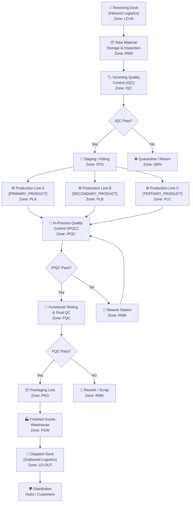
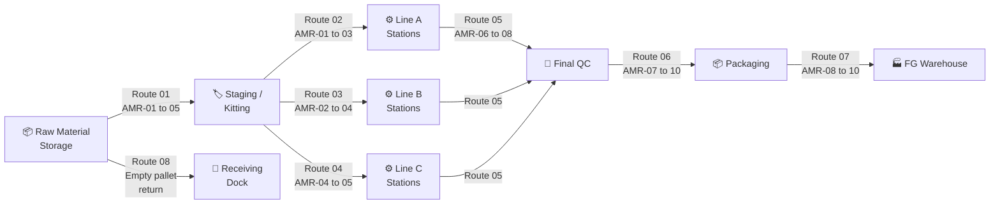

# [FACTORY_NAME] — Factory Floor Plan & Layout

> **Project Coo-Cah | AI-Powered Manufacturing Ecosystem**
> **Factory:** [FACTORY_NAME] | **Location:** [LOCATION] | **Phase:** [PHASE]
> **Document Version:** 1.0 | **Owner:** Factory Engineering & Facilities

---

## 1. Overview

This document describes the physical layout of [FACTORY_NAME], including production flow, zone definitions, material handling routing paths, and the integration of AMR (Autonomous Mobile Robot) navigation lanes. The layout is designed according to Lean Manufacturing principles — minimising waste, maximising material flow velocity, and providing clear separation between raw material, work-in-progress, and finished goods areas.

**Total Facility Area:** [AREA] m²
**Building Footprint:** [FOOTPRINT] m²
**Clear Internal Height:** [HEIGHT] m (production areas)
**Number of Buildings:** [N]
**Loading Docks:** [N] (inbound) + [N] (outbound)

---

## 2. Overall Factory Flow Diagram

The following Mermaid flowchart shows the primary production flow through the factory, from goods receipt to dispatch.

---

## 3. Zone Descriptions

### Zone LD-IN — Receiving Dock

| Attribute          | Detail                                                     |
|--------------------|------------------------------------------------------------|
| Area               | [AREA] m²                                                  |
| Number of Bays     | [N] bays (dock-levellers with seals)                       |
| Equipment          | Electric forklift ([N]×), pallet jacks, dock bumpers       |
| AMR Interface      | AMR pickup points at dock bay exits                        |
| Key Activities     | Container/truck offloading, pallet labelling, GRN creation |
| MES Integration    | GRN barcode scan triggers inventory receipt event          |

The Receiving Dock is the primary entry point for all inbound raw materials, components, and packaging materials. All inbound goods are registered in the MES via GRN (Goods Receipt Note) before proceeding to raw material storage.

### Zone RMS — Raw Material Storage

| Attribute          | Detail                                                    |
|--------------------|-----------------------------------------------------------|
| Area               | [AREA] m²                                                 |
| Storage Type       | Selective pallet racking + vertical lift modules (VLM)   |
| Capacity           | [N] pallet positions + [N] VLM trays                     |
| Temperature Control| [YES/NO] — [TEMP_RANGE]°C for sensitive components       |
| AMR Routes         | AMR-01 to AMR-05 lanes (marked on floor, SLAM-mapped)    |
| Key Activities     | FIFO inventory management, bin replenishment, cycle counts |
| MES Integration    | Bin location tracking, FIFO dispatch rules                |

Raw Material Storage operates on strict FIFO rules enforced by the MES. The Vertical Lift Modules provide high-density storage for small components (PCBs, ICs, connectors). Temperature-sensitive materials (e.g., solder paste, adhesives) are stored in dedicated climate-controlled cabinets.

### Zone IQC — Incoming Quality Control

| Attribute          | Detail                                                    |
|--------------------|-----------------------------------------------------------|
| Area               | [AREA] m²                                                 |
| Equipment          | CMM, digital calipers, [SPECIFIC_QC_EQUIPMENT]            |
| Sampling Standard  | AQL 2.5 (ANSI/ASQ Z1.4)                                  |
| Lab Environment    | Temperature: 20±2°C, Humidity: 45–65% RH                 |
| MES Integration    | IQC results linked to batch records; auto-quarantine on fail |

### Zone STG — Staging & Kitting

| Attribute          | Detail                                                     |
|--------------------|------------------------------------------------------------|
| Area               | [AREA] m²                                                  |
| Equipment          | AMR handoff points, kitting trolleys, label printers       |
| Key Activities     | BOM-driven kit assembly, WIP label printing, AMR loading   |
| MES Integration    | Job order release triggers kitting list; kit confirmed by scan |

Staging is the gateway between stores and production. Kits are assembled per MES job order and handed to AMRs for delivery to the correct production line station. This eliminates operator trips to stores and reduces line-side inventory.

### Zone PLA — Production Line A

| Attribute          | Detail                                                     |
|--------------------|------------------------------------------------------------|
| Area               | [AREA] m²                                                  |
| Product            | [PRIMARY_PRODUCT]                                          |
| Flow Type          | [CONTINUOUS / BATCH / MIXED]                               |
| Stations           | [N] workstations in series                                 |
| Cycle Time (takt)  | [TAKT_TIME] seconds/unit                                   |
| Equipment          | [KEY_MACHINES_LIST]                                        |
| AMR Routes         | Dedicated inbound/outbound AMR lane (Line A corridor)      |
| MES Integration    | Per-station scan, cycle time tracking, OEE calculation     |

[Description of the primary product assembly process, key operations performed, and quality checkpoints within this line.]

### Zone PLB — Production Line B

| Attribute          | Detail                                                     |
|--------------------|------------------------------------------------------------|
| Area               | [AREA] m²                                                  |
| Product            | [SECONDARY_PRODUCT]                                        |
| Flow Type          | [CONTINUOUS / BATCH / MIXED]                               |
| Stations           | [N] workstations                                           |
| Equipment          | [KEY_MACHINES_LIST]                                        |
| AMR Routes         | Shared AMR corridor with Line C                            |

### Zone PLC — Production Line C

| Attribute          | Detail                                                     |
|--------------------|------------------------------------------------------------|
| Area               | [AREA] m²                                                  |
| Product            | [TERTIARY_PRODUCT]                                         |
| Flow Type          | Batch                                                      |
| Stations           | [N] workstations                                           |
| Notes              | Shared tooling with Line B; quick changeover < 30 minutes  |

### Zone IPQC — In-Process Quality Control

| Attribute          | Detail                                                     |
|--------------------|------------------------------------------------------------|
| Area               | [AREA] m²                                                  |
| Location           | Between production lines and Final QC                      |
| Equipment          | [IPQC_MACHINES]                                            |
| Key Activities     | Statistical process control, first-off / last-off checks   |
| MES Integration    | IPQC data feeds real-time SPC charts on MES dashboard      |

### Zone RWK — Rework Station

| Attribute          | Detail                                                     |
|--------------------|------------------------------------------------------------|
| Area               | [AREA] m²                                                  |
| Equipment          | Rework bench, soldering station, [REWORK_TOOLS]            |
| MES Integration    | Rework reason codes; rework count tracked per unit serial  |
| Scrap Disposal     | Secured scrap bin, weekly disposal per EHS procedure       |

### Zone FQC — Final Quality Control & Testing

| Attribute          | Detail                                                     |
|--------------------|------------------------------------------------------------|
| Area               | [AREA] m²                                                  |
| Equipment          | [FQC_MACHINES — functional testers, safety testers]        |
| Test Coverage      | 100% final test (no sampling for finished goods)           |
| Label Application  | CE/SON/SAA labels applied on pass                          |
| MES Integration    | Test pass = serial number released for packaging           |

### Zone PKG — Packaging Line

| Attribute          | Detail                                                     |
|--------------------|------------------------------------------------------------|
| Area               | [AREA] m²                                                  |
| Equipment          | Auto carton erector, fill station, sealer, labeller        |
| Throughput         | [N] units/hour                                             |
| MES Integration    | Carton serial + outer box label scanning; shipment record  |

### Zone FGW — Finished Goods Warehouse

| Attribute          | Detail                                                     |
|--------------------|------------------------------------------------------------|
| Area               | [AREA] m²                                                  |
| Storage Type       | Drive-in racking + beam racking (high-value products)      |
| Capacity           | [N] pallet positions                                       |
| FIFO Enforcement   | MES WMS module                                             |
| Security           | CCTV, access control, restricted entry                     |
| AMR Routes         | AMR delivery from packaging; AMR loading for dispatch      |

### Zone LD-OUT — Dispatch Dock

| Attribute          | Detail                                                     |
|--------------------|------------------------------------------------------------|
| Area               | [AREA] m²                                                  |
| Number of Bays     | [N] bays                                                   |
| Key Activities     | Pallet loading, despatch note generation, truck sealing    |
| MES Integration    | Despatch scan triggers outbound shipment event; ERP alert  |

---

## 4. AMR Routing Plan

### 4.1 AMR Navigation Infrastructure

- **Navigation Technology:** LiDAR-based SLAM — no floor magnets or rails required. AMRs build and maintain a live map of the factory floor.
- **AMR Lanes:** Painted yellow lanes (300mm wide borders) define preferred AMR travel corridors. AMRs can deviate for obstacle avoidance but return to lane.
- **Speed Limit Zones:**
  - Production Floor (near operators): 0.5 m/s
  - Main corridors: 1.2 m/s
  - Warehouse aisles: 0.8 m/s
- **Pedestrian Crossing Points:** Designated zebra crossings with warning lights/buzzers triggered by approaching AMRs.
- **Emergency Stop:** Any factory worker can press E-stop on any AMR. Whole-fleet stop also available via MES.

### 4.2 Primary AMR Routes

### 4.3 AMR Fleet Assignments

| AMR Unit  | Primary Route     | Shift Assignment | Payload (kg) | Charging Bay |
|-----------|-------------------|------------------|--------------|--------------|
| AMR-01    | RMS → STG → PLA   | All shifts       | [KG]         | Bay-01       |
| AMR-02    | RMS → STG → PLB   | All shifts       | [KG]         | Bay-02       |
| AMR-03    | STG → PLA → IPQC  | All shifts       | [KG]         | Bay-03       |
| AMR-04    | STG → PLB/PLC     | All shifts       | [KG]         | Bay-04       |
| AMR-05    | IPQC → FQC → PKG  | All shifts       | [KG]         | Bay-05       |
| AMR-06    | PKG → FGW         | Day/Afternoon    | [KG]         | Bay-06       |
| AMR-07    | FGW → LD-OUT      | Day/Afternoon    | [KG]         | Bay-07       |
| AMR-08    | Empty pallet/trash return | All shifts | [KG]        | Bay-08       |
| AMR-09    | Spare / overflow  | On demand        | [KG]         | Bay-09       |
| AMR-10    | Spare / overflow  | On demand        | [KG]         | Bay-10       |

---

## 5. Utility & Services Layout

### 5.1 Compressed Air Distribution

- Main air compressor room located adjacent to external wall (Zone UTL)
- Ring main distribution at 7 bar, reduced to 5 bar at point of use via regulators
- Drop points at every production station (1 per station) and packaging line
- Air quality: ISO 8573-1 Class 2.4.1 for assembly/testing areas

### 5.2 Electrical Distribution

- Main LV switchboard (MCC) located in dedicated electrical room (Zone ELEC)
- Sub-distribution boards at each production zone
- All production equipment on separate MCBs/MCCBs with surge protection
- ESD-protected zone (EPA) covering all PCB assembly and electronics handling areas

### 5.3 Fire Safety

- Sprinkler system throughout (NFPA 13 standard or BS EN 12845)
- Addressable fire alarm panel (zones corresponding to factory zones)
- CO₂/clean agent suppression in BESS room and electrical rooms
- Fire escape routes clearly marked; minimum 2 exits per production zone
- Fire extinguisher types: CO₂ (electrical), dry powder (general), foam (chemical stores)

### 5.4 EHS Infrastructure

- Eye wash stations: one per production zone
- First aid room (Zone EHS) equipped to OSHA first aid minimum standard
- Hazardous material storage (HAZMAT room): separate from main production, ventilated, bunded
- Fume extraction: over all soldering stations, chemical handling areas
- PPE station at entry to each production zone

---

## 6. Expansion Provisions

The factory layout has been designed with future expansion in mind:

| Expansion Zone       | Area Reserved (m²) | Intended Use                              | Phase    |
|----------------------|--------------------|-------------------------------------------|----------|
| East Extension       | [AREA] m²          | Additional production line (Line D)       | Phase 2  |
| Mezzanine (Stores)   | [AREA] m²          | Additional storage above IQC zone         | Phase 2  |
| New Warehouse Block  | [AREA] m²          | Standalone FG warehouse with dock         | Phase 3  |
| Rooftop Solar Ext.   | [AREA] m²          | Additional [KWP] kWp solar capacity       | Phase 2  |

---

*For detailed machinery placement within zones, refer to [`machinery.md`](./machinery.md).*
*For AMR fleet management integration, refer to [`mes-integration.md`](./mes-integration.md).*
