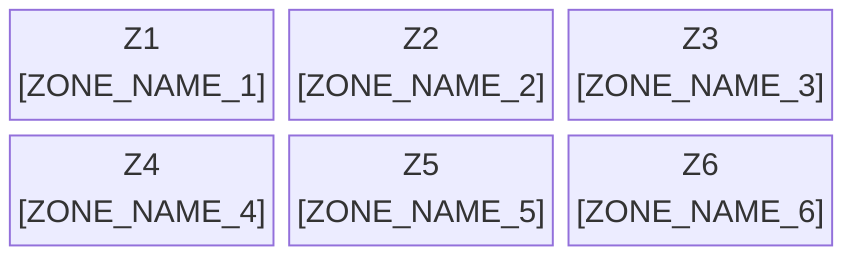

# Security Electronics — Floor Plan Diagram

> **Gate 3 Artifact (Digital Twin Visual Readiness)**
> **Owner:** Facilities Engineering | **Zone Source:** [`floor-plan.md`](../../floor-plan.md)

Mermaid block-diagram representation of the factory floor plan. Zone IDs MUST match those defined in [`floor-plan.md`](../../floor-plan.md).

---

## Floor Plan

> **Note:** Replace zone placeholders with actual zone IDs and names from `floor-plan.md`. Add or remove blocks to match the real layout.

---

## Zone Legend

| Zone ID | Zone Name | Area (m²) | Primary Function | Notes |
|---------|-----------|-----------|-----------------|-------|
| Z1 | [ZONE_NAME_1] | [AREA] | [FUNCTION] | |
| Z2 | [ZONE_NAME_2] | [AREA] | [FUNCTION] | |
| Z3 | [ZONE_NAME_3] | [AREA] | [FUNCTION] | |
| Z4 | [ZONE_NAME_4] | [AREA] | [FUNCTION] | |
| Z5 | [ZONE_NAME_5] | [AREA] | [FUNCTION] | |
| Z6 | [ZONE_NAME_6] | [AREA] | [FUNCTION] | |

---

## AMR Route Overlay

| Route ID | From Zone | To Zone | AMR Fleet | Frequency | Notes |
|----------|-----------|---------|-----------|-----------|-------|
| RT-01 | Z1 | Z2 | [AMR_MODEL] | [FREQ] | [DESCRIPTION] |
| RT-02 | Z2 | Z3 | [AMR_MODEL] | [FREQ] | [DESCRIPTION] |

---

## Related Documents

| Document | Purpose |
|----------|---------|
| [`floor-plan.md`](../../floor-plan.md) | Authoritative zone definitions and area specifications |
| [`bim/zone-boundaries.md`](../bim/zone-boundaries.md) | BIM coordinate boundaries for each zone |
| [`digital-twin-renders.md`](./digital-twin-renders.md) | 3D render files aligned to this layout |
