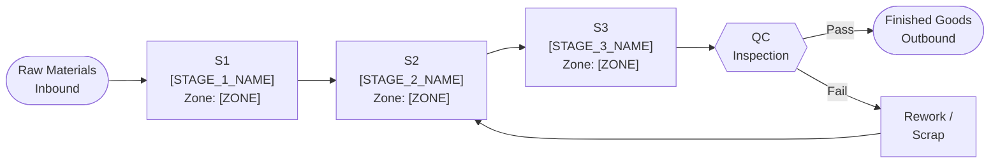

# Furniture Decor — Process Flow Diagram

> **Gate 3 Artifact (Digital Twin Visual Readiness)**
> **Owner:** Manufacturing Engineering | **MES Source:** [`mes-integration.md`](../../mes-integration.md)

End-to-end production process flow for **Furniture Decor**. Stage IDs MUST align with MES workflow definitions in [`mes-integration.md`](../../mes-integration.md). Zone IDs MUST match [`floor-plan.md`](../../floor-plan.md).

---

## Process Flow

> **Note:** Expand or simplify stages to match the actual production process. Reference `mes-integration.md` for MES workflow IDs.

---

## Stage Register

| Stage ID | Stage Name | Zone ID | Key Equipment | MES Workflow ID | Cycle Time | Notes |
|----------|------------|---------|---------------|-----------------|------------|-------|
| S1 | [STAGE_1_NAME] | [ZONE] | [EQUIPMENT] | [MES_WF_ID] | [TIME] | |
| S2 | [STAGE_2_NAME] | [ZONE] | [EQUIPMENT] | [MES_WF_ID] | [TIME] | |
| S3 | [STAGE_3_NAME] | [ZONE] | [EQUIPMENT] | [MES_WF_ID] | [TIME] | |

---

## Quality Gate Summary

| Gate ID | After Stage | Inspection Type | Pass Criteria | Owner |
|---------|-------------|-----------------|---------------|-------|
| QG-01 | S1 | [INSPECTION_TYPE] | [CRITERIA] | Quality Engineering |
| QG-02 | S3 | [INSPECTION_TYPE] | [CRITERIA] | Quality Engineering |

---

## Related Documents

| Document | Purpose |
|----------|---------|
| [`mes-integration.md`](../../mes-integration.md) | MES workflow IDs and data point definitions |
| [`floor-plan.md`](../../floor-plan.md) | Zone IDs referenced in the stage register |
| [`digital-twin.md`](../../digital-twin.md) | Asset registry for equipment listed in stages |
